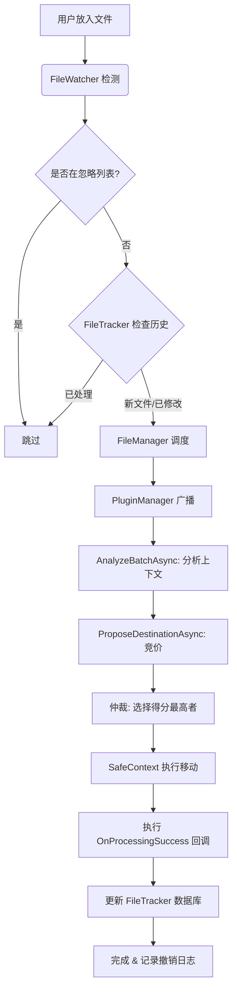

# SmartFileMan 开发者指南

欢迎使用 SmartFileMan 开发框架。这是一个模块化、可扩展的智能文件管理系统。本文档将指导你如何开发插件、使用核心 API、存储数据以及发布安全的插件。

## 目录

1. [架构概览](#1-架构概览)
2. [开发环境设置](#2-开发环境设置)
3. [开发第一个插件](#3-开发第一个插件)
4. [核心 API 参考](#4-核心-api-参考)
5. [插件 UI 开发](#5-插件-ui-开发)
6. [数据存储 (LiteDB)](#6-数据存储-litedb)
7. [插件安全与签名](#7-插件安全与签名)

---

## 1. 架构概览

SmartFileMan 采用分层架构设计：

*   **Contracts (契约层)**: 定义了系统核心接口 (`IPlugin`, `IFileEntry`, `RouteProposal`)。
*   **SDK (工具包)**: 提供了开发者基类 (`PluginBase`) 和安全上下文 (`SafeContext`)。
*   **Core (核心层)**: 实现了插件加载、竞价仲裁 (`PluginManager`) 和文件调度 (`FileManager`)。
*   **App (应用层)**: .NET MAUI 用户界面。

### 核心机制：全景竞价流水线 (Batch Bidding Pipeline)

系统采用“**输入扁平化 -> 全景分析 -> 竞价**”模式：

1.  **输入扁平化 (Flattening)**: 用户拖入的文件夹会被系统自动拆解，提取其中所有文件，形成一个“扁平化”的批次 (Batch)。
2.  **全景分析 (Phase 0: Analyze)**: 
    *   所有插件收到 `AnalyzeBatchAsync(BatchContext)` 调用。
    *   **Context**: 包含该批次所有文件的列表。
    *   **作用**: 插件可以在此阶段遍历所有文件，识别文件之间的关联（如：游戏存档与预览图、多部分压缩包），并在内存中建立索引。
3.  **竞价 (Phase 1: Bid)**: 
    *   系统逐个询问每个文件 (`ProposeDestinationAsync`)。
    *   插件根据 Phase 0 建立的上下文信息，给出更智能的建议（例如：让预览图跟随存档文件移动）。
4.  **仲裁 (Arbitrate)**: 系统选择分数最高的提案执行移动操作。

---

## 2. 开发环境设置

### 启用开发者模式

默认情况下，SmartFileMan 仅加载经过数字签名的插件。为了方便开发调试，你可以开启“开发者模式”来加载未签名的插件。

1.  启动 SmartFileMan。
2.  进入 **设置 (Settings)** 页面。
3.  找到 **开发者选项**，开启 **开发者模式 (Developer Mode)**。
4.  **重启应用**以生效。

> **注意**: 开发者模式仅用于测试，生产环境请务必对插件进行签名。

---

## 3. 开发第一个插件

### 步骤 1: 创建项目

创建一个新的 .NET 类库项目 (Class Library)，目标框架建议为 `.NET 10`。
引用 `SmartFileMan.Contracts` 和 `SmartFileMan.Sdk` 项目或 DLL。

### 步骤 2: 继承 `PluginBase`

```csharp
using SmartFileMan.Sdk;
using SmartFileMan.Contracts;
using SmartFileMan.Contracts.Models;
using System.Threading.Tasks;
using System.IO;

public class MyInvoicePlugin : PluginBase
{
    public override string Id => "com.example.invoice";
    public override string DisplayName => "发票归档助手";
    public override string Description => "自动识别并归档发票 PDF";

    // 设置插件类型：Specific (专用) 通常比 General (通用) 权重更高
    public override PluginType Type => PluginType.Specific;

    // 阶段零：全景分析
    public override async Task AnalyzeBatchAsync(BatchContext context)
    {
        // 遍历本次批处理的所有文件，建立关联
        foreach (var file in context.AllFiles)
        {
            // 例如：记录所有文件名，以便后续判断是否有同名文件
            _fileNamesInBatch.Add(file.Name);
        }
        await Task.CompletedTask;
    }

    // 阶段一：观察 (可选)
    public override async Task OnFileDetectedAsync(IFileEntry file)
    {
        // 你可以在这里预加载数据或更新统计
        await Task.CompletedTask;
    }

    // 阶段二：竞价 (核心)
    public override async Task<RouteProposal?> ProposeDestinationAsync(IFileEntry file)
    {
        // 1. 检查是否是 PDF
        if (file.Extension != ".pdf") return null; // 不感兴趣

        // 2. 检查文件名是否包含关键词
        if (file.Name.Contains("发票") || file.Name.Contains("Invoice"))
        {
            // 3. 生成目标路径
            string targetPath = Path.Combine("D:\\Documents\\Invoices", $"{DateTime.Now.Year}", file.Name);
            
            // 4. 返回提案，给出高分 (90分)
            return new RouteProposal(targetPath, 90, "检测到发票关键词");
        }

        return null; // 不处理
    }

    // 旧版接口实现 (如果不需要批量处理，留空即可)
    public override Task ExecuteAsync(IList<IFileEntry> files) => Task.CompletedTask;
}
```

### 步骤 3: 部署测试

1.  编译你的插件项目。
2.  将生成的 `.dll` 文件复制到 SmartFileMan 的 `Plugins` 目录下。
3.  确保已开启 **开发者模式**。
4.  重启 SmartFileMan，在 **插件管理** 页面应能看到你的插件。

> **提示：自动化部署**
> 为了提高开发效率，你可以在 `.csproj` 文件中添加 `PostBuild` 目标，使得编译后自动将 DLL 复制到调试目录。
> 示例代码（请根据你的实际路径修改 `DestinationFolder`）：
> ```xml
> <Target Name="PostBuild" AfterTargets="PostBuildEvent">
>     <Copy SourceFiles="$(TargetPath)" 
>           DestinationFolder="$(SolutionDir)src\SmartFileMan.App\bin\Debug\net10.0-windows10.0.19041.0\win-x64\AppX\Plugins\" 
>           Condition="'$(Configuration)' == 'Debug'" />
> </Target>
> ```

---

## 4. 核心 API 参考

在继承 `PluginBase` 的类中，你可以直接调用以下方法。这些操作都是**安全且可撤销**的。

### 文件操作

*   **`Rename(IFileEntry file, string newName)`**
    *   重命名文件。
    *   示例: `await Rename(file, "NewName.txt");`

*   **`Move(IFileEntry file, string destinationFolder)`**
    *   移动文件到指定文件夹。
    *   示例: `await Move(file, "D:\\Archive");`

*   **`Delete(IFileEntry file)`**
    *   **安全删除**：将文件移动到系统的临时回收站 (`SmartFileMan_RecycleBin`)。
    *   支持撤销。
    *   示例: `await Delete(file);`

### 批处理与事务 (Batching & Transactions)

`SafeContext` 支持将一系列操作作为一个原子事务进行处理，这意味着撤销时会一次性还原所有操作。

*   **`SafeContext.BeginBatch(string name)`**: 开启一个具名事务。
*   **`SafeContext.CommitBatch()`**: 提交事务。

### `IFileEntry` 对象

代表一个文件，提供比 `FileInfo` 更丰富的抽象：

*   `Id`: 文件唯一标识。
*   `Name`: 文件名 (e.g., "report.pdf").
*   `Extension`: 小写扩展名 (e.g., ".pdf").
*   `FullPath`: 完整路径。
*   `GetHashAsync()`: 获取文件哈希 (SHA256)。
*   `OpenReadAsync()`: 打开读取流。

---

## 5. 插件 UI 开发

如果你的插件需要配置界面或状态展示，可以实现 `IPluginUI` 接口。

```csharp
using SmartFileMan.Contracts;
using Microsoft.Maui.Controls;

public class MyInvoicePlugin : PluginBase, IPluginUI
{
    // ... 其他代码 ...

    public View GetView()
    {
        // 返回一个 MAUI View，例如 ContentView 或 Grid
        // 你可以创建一个 XAML ContentView 并返回其实例
        return new Label { Text = "这是发票插件的设置界面" };
    }
}
```

---

## 6. 数据存储 (LiteDB)

每个插件都自动获得了一个隔离的 NoSQL 存储空间。你不需要关心数据库连接，直接使用 `Storage` 属性即可。

### 数据库连接与调试
SmartFileMan 使用 LiteDB 的 `Shared` 模式，这意味着你可以在应用运行时使用外部工具（如 LiteDB Studio）以只读或写入模式打开 `smartfileman.db` 进行调试。

文件路径通常位于：`C:\Users\<User>\AppData\Local\Packages\<PackageId>\LocalState\smartfileman.db` (UWP/MAUI)
或 `AppData\Roaming\SmartFileMan` (传统桌面)。

### 保存数据

```csharp
// 保存简单的配置
Storage.Save("LastRunTime", DateTime.Now);

// 保存复杂对象
var config = new MyConfig { AutoSort = true, TargetFolder = "D:\\Docs" };
Storage.Save("UserConfig", config);
```

### 读取数据

```csharp
// 读取配置，如果不存在则返回默认值
var lastRun = Storage.Load<DateTime>("LastRunTime", DateTime.MinValue);

var config = Storage.Load<MyConfig>("UserConfig");
if (config == null) 
{
    // 初始化默认配置
}
```

---

## 7. 插件安全与签名

为了保证系统安全，SmartFileMan 在非开发者模式下会校验插件的数字签名。

### 签名工具 (SmartFileMan.Signer)

我们提供了一个命令行工具 `SmartFileMan.Signer` 用于生成密钥和签名。

#### 生成密钥对

```bash
dotnet run --project src/SmartFileMan.Signer -- keygen Keys
```
这将生成 `private.key` (私钥，请妥善保管) 和 `public.key` (公钥，分发给 App)。

#### 给插件签名

```bash
dotnet run --project src/SmartFileMan.Signer -- sign "Path/To/MyPlugin.dll" "Path/To/private.key"
```
这将生成 `MyPlugin.dll.sig` 文件。

### 自动签名 (推荐)

在你的插件 `.csproj` 文件中添加 `PostBuild` 事件，实现编译后自动签名：

```xml
<Target Name="PostBuild" AfterTargets="PostBuildEvent">
    <Exec Command="dotnet run --project &quot;$(SolutionDir)src\SmartFileMan.Signer\SmartFileMan.Signer.csproj&quot; -- sign &quot;$(TargetPath)&quot; &quot;$(SolutionDir)Keys\private.key&quot;" />
</Target>
```

### 发布

发布插件时，请同时提供：
1.  `MyPlugin.dll`
2.  `MyPlugin.dll.sig`

用户将这两个文件放入 `Plugins` 目录后，SmartFileMan 会自动验证签名并加载插件。

---

## 8. 文件处理完整流程

当一个文件被放入 SmartFileMan 监控的文件夹（或手动扫描）后，系统会按照以下流程进行处理：

### 1. 触发监控 (File Detection)
*   `FileWatcherService` 监听到文件系统变更（例如 `Created` 或 `Renamed` 事件）。
*   系统会进行简单的防抖处理（防止文件写入未完成时触发）。
*   生成一个 `IFileEntry` 对象（包含路径、哈希、扩展名等信息）。

### 2. 调度中心 (File Manager)
*   文件被送入 `FileManager.ProcessFileAsync()`。
*   系统首先检查该文件扩展名是否在**忽略列表 (Ignored Extensions)** 中。如果是，则跳过处理。
*   接着调用 `PluginManager.GetBestRouteAsync()` 获取最佳处理方案。

### 3. 插件竞价 (Plugin Bidding Loop)
系统遍历所有已启用的插件，执行“观察-竞价”流程：

*   **阶段一：观察 (Observe)**
    *   调用插件的 `OnFileDetectedAsync(file)`。
    *   插件可以进行轻量级检查（如更新统计），但不能修改文件。

*   **阶段二：竞价 (Bid)**
    *   调用插件的 `ProposeDestinationAsync(file)`。
    *   插件根据文件特征判断是否能够处理。
    *   如果能处理，返回一个 `RouteProposal` 对象，包含：
        *   `DestinationPath`: 建议的目标路径。
        *   `Score`: 信心分数 (0-100)。
        *   `Description`: 处理理由（用于日志）。
    *   如果不能处理，返回 `null`。

### 4. 仲裁 (Arbitration)
*   `PluginManager` 收集所有插件的提案。
*   根据分数 (`Score`) 进行降序排序。
*   选择分数最高的提案作为最终决策（Winner）。
*   如果没有插件出价，流程结束（文件保持原样）。

### 5. 执行操作 (Execution)
*   `FileManager` 拿到最佳提案 (`Winner`)。
*   使用 `SafeContext` 执行**安全移动**操作：
    *   记录操作日志（用于支持撤销）。
    *   尝试移动文件到目标路径。
    *   如果目标文件夹不存在，会自动创建。
    *   如果目标路径有同名文件，会自动重命名（如 `file (1).txt`）。
*   **回调 (Callbacks)**: 如果提案包含 `OnProcessingSuccess` 委托，系统会在移动成功后执行该委托。这对于插件保存自定义索引（如音乐历史记录）非常有用。

### 6. 增量更新与去重 (File Tracker)
系统内置了 `FileTracker` 机制，确保处理过程高效且不重复：
*   **状态检查**: 在处理前，系统会对比数据库，如果文件的路径、修改时间和大小均未改变，则视作“已处理”并跳过。
*   **内容签名**: 成功移动后，系统会计算文件的 SHA256 哈希值并保存，即使文件被更名，系统也能识别其内容。

### 示例流程图



---

## 9. 最佳实践与规范

### 双语注释标准 (Bilingual Comments)
为了保证代码的可维护性，所有公开的方法、属性和复杂的逻辑块必须包含中英文双语注释：
```csharp
/// <summary>
/// 获取插件的显示名称
/// Gets the display name of the plugin
/// </summary>
public string DisplayName => "...";
```

### 插件存储清理
用户可以在应用设置中执行“清除所有数据 (Clear All Data)”。插件不应在本地保存硬编码路径的缓存，而应全部依赖 `IPluginStorage`。当用户执行清理时，`PluginManager` 会自动删除插件的所有集合数据。

### UI 性能优化
*   插件 UI (`GetView()`) 应采用延迟加载。
*   避免在 `ProposeDestinationAsync` 中执行由于 UI 引起的耗时操作。
*   对于大量数据的列表（如音乐库），请使用 `CollectionView` 的数据虚拟化特性。
*   **序列化安全**: 存入 `IPluginStorage` 的对象必须是纯 POCO 类。禁止存入 `ImageSource` 等 UI 控件类型，否则会导致 `InvalidOperationException`。建议存储文件路径或 Base64 字符串，并通过 `Converter` 在 UI 层转换。


