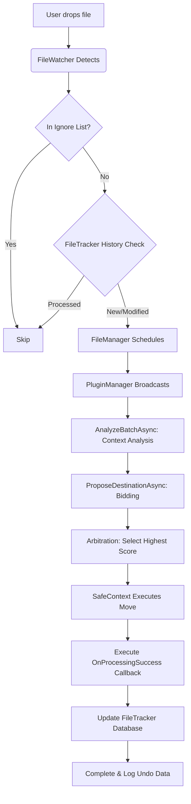

# SmartFileMan Developer Guide

Welcome to the SmartFileMan development framework. This is a modular, extensible, and intelligent file management system. This document will guide you on how to develop plugins, use core APIs, manage data storage, and publish secure plugins.

## Table of Contents

1. [Architecture Overview](#1-architecture-overview)
2. [Development Environment Setup](#2-development-environment-setup)
3. [Developing Your First Plugin](#3-developing-your-first-plugin)
4. [Core API Reference](#4-core-api-reference)
5. [Plugin UI Development](#5-plugin-ui-development)
6. [Data Storage (LiteDB)](#6-data-storage-litedb)
7. [Plugin Security & Signing](#7-plugin-security--signing)
8. [Complete File Processing Workflow](#8-complete-file-processing-workflow)
9. [Best Practices and Guidelines](#9-best-practices-and-guidelines)

---

## 1. Architecture Overview

SmartFileMan adopts a layered architecture design:

*   **Contracts**: Defines the core interfaces of the system (`IPlugin`, `IFileEntry`, `RouteProposal`).
*   **SDK**: Provides developer base classes (`PluginBase`) and secure contexts (`SafeContext`).
*   **Core**: Implements plugin loading, bidding arbitration (`PluginManager`), and file scheduling (`FileManager`).
*   **App**: The .NET MAUI user interface.

### Core Mechanism: Batch Bidding Pipeline

The system uses a "**Flattening Input -> Contextual Analysis -> Bidding**" model:

1.  **Flattening**: Folders dragged in by the user are automatically disassembled to extract all files within them, forming a "flattened" Batch.
2.  **Phase 0: Analyze (Context Awareness)**: 
    *   All plugins receive an `AnalyzeBatchAsync(BatchContext)` call.
    *   **Context**: Contains a list of all files in the current batch.
    *   **Purpose**: Plugins can traverse all files at this stage to identify implicit relationships between them (e.g., game saves and preview images, multi-part archives) and build an index in memory.
3.  **Phase 1: Bid**: 
    *   The system asks for proposals file by file (`ProposeDestinationAsync`).
    *   Plugins provide smarter suggestions based on the context built in Phase 0 (e.g., making the preview image follow the save file).
4.  **Arbitrate**: The system selects the proposal with the highest score to execute the move operation.

---

## 2. Development Environment Setup

### Enabling Developer Mode

By default, SmartFileMan only loads plugins with valid digital signatures. To facilitate development and debugging, you can enable "Developer Mode" to load unsigned plugins.

1.  Launch SmartFileMan.
2.  Go to the **Settings** page.
3.  Find **Developer Options** and enable **Developer Mode**.
4.  **Restart the application** for the changes to take effect.

> **Note**: Developer Mode is for testing purposes only. Always sign your plugins before deploying them to production.

---

## 3. Developing Your First Plugin

### Step 1: Create a Project

Create a new .NET Class Library project. The recommended target framework is `.NET 10`.
Add references to the `SmartFileMan.Contracts` and `SmartFileMan.Sdk` projects or DLLs.

### Step 2: Inherit `PluginBase`

```csharp
using SmartFileMan.Sdk;
using SmartFileMan.Contracts;
using SmartFileMan.Contracts.Models;
using System.Threading.Tasks;
using System.IO;

public class MyInvoicePlugin : PluginBase
{
    public override string Id => "com.example.invoice";
    public override string DisplayName => "Invoice Archiver";
    public override string Description => "Automatically identifies and archives invoice PDFs.";

    // Set Plugin Type: Specific generally has a higher weight than General
    public override PluginType Type => PluginType.Specific;

    // Phase 0: Contextual Analysis
    public override async Task AnalyzeBatchAsync(BatchContext context)
    {
        // Traverse all files in this batch to establish relationships
        foreach (var file in context.AllFiles)
        {
            // E.g., record all filenames for subsequent judgments
            _fileNamesInBatch.Add(file.Name);
        }
        await Task.CompletedTask;
    }

    // Phase 1: Observation (Optional)
    public override async Task OnFileDetectedAsync(IFileEntry file)
    {
        // You can preload data or update statistics here
        await Task.CompletedTask;
    }

    // Phase 2: Bidding (Core)
    public override async Task<RouteProposal?> ProposeDestinationAsync(IFileEntry file)
    {
        // 1. Check if it's a PDF
        if (file.Extension != ".pdf") return null; // Not interested

        // 2. Check if the filename contains targeted keywords
        if (file.Name.Contains("发票") || file.Name.Contains("Invoice"))
        {
            // 3. Generate target path
            string targetPath = Path.Combine("D:\\Documents\\Invoices", $"{DateTime.Now.Year}", file.Name);
            
            // 4. Return proposal with a high score (90)
            return new RouteProposal(targetPath, 90, "Detected invoice keyword");
        }

        return null; // Do not process
    }

    // Legacy interface implementation (Leave empty if batch processing is not needed)
    public override Task ExecuteAsync(IList<IFileEntry> files) => Task.CompletedTask;
}
```

### Step 3: Deployment Testing

1.  Compile your plugin project.
2.  Copy the generated `.dll` file to the `Plugins` directory of SmartFileMan.
3.  Ensure **Developer Mode** is enabled.
4.  Restart SmartFileMan. You should see your plugin on the **Plugin Management** page.

> **Tip: Automated Deployment**
> To improve development efficiency, you can add a `PostBuild` target in the `.csproj` file to automatically copy the DLL to the debugging directory after compilation.
> Example code (please modify `DestinationFolder` according to your actual path):
> ```xml
> <Target Name="PostBuild" AfterTargets="PostBuildEvent">
>     <Copy SourceFiles="$(TargetPath)" 
>           DestinationFolder="$(SolutionDir)src\SmartFileMan.App\bin\Debug\net10.0-windows10.0.19041.0\win-x64\AppX\Plugins\" 
>           Condition="'$(Configuration)' == 'Debug'" />
> </Target>
> ```

---

## 4. Core API Reference

In a class inheriting from `PluginBase`, you can directly call the following methods. These operations are **safe and undoable**.

### File Operations

*   **`Rename(IFileEntry file, string newName)`**
    *   Renames a file.
    *   Example: `await Rename(file, "NewName.txt");`

*   **`Move(IFileEntry file, string destinationFolder)`**
    *   Moves a file to the specified folder.
    *   Example: `await Move(file, "D:\\Archive");`

*   **`Delete(IFileEntry file)`**
    *   **Safe Deletion**: Moves the file to the system's temporary recycle bin (`SmartFileMan_RecycleBin`).
    *   Supports Undo.
    *   Example: `await Delete(file);`

### Batching & Transactions

`SafeContext` supports processing a series of operations as an atomic transaction, meaning an undo will revert all operations at once.

*   **`SafeContext.BeginBatch(string name)`**: Starts a named transaction.
*   **`SafeContext.CommitBatch()`**: Commits the transaction.

### `IFileEntry` Object

Represents a file, providing richer abstraction than `FileInfo`:

*   `Id`: Unique identifier for the file.
*   `Name`: File name (e.g., "report.pdf").
*   `Extension`: Lowercase extension (e.g., ".pdf").
*   `FullPath`: Full path.
*   `GetHashAsync()`: Gets the file hash (SHA256).
*   `OpenReadAsync()`: Opens a read stream.

---

## 5. Plugin UI Development

If your plugin requires a configuration interface or status display, you can implement the `IPluginUI` interface.

```csharp
using SmartFileMan.Contracts;
using Microsoft.Maui.Controls;

public class MyInvoicePlugin : PluginBase, IPluginUI
{
    // ... other code ...

    public View GetView()
    {
        // Return a MAUI View, such as a ContentView or Grid.
        // You can create a XAML ContentView and return its instance.
        return new Label { Text = "This is the settings page for the Invoice Plugin." };
    }
}
```

---

## 6. Data Storage (LiteDB)

Each plugin automatically receives an isolated NoSQL storage space. You don't need to worry about database connections; just use the `Storage` property directly.

### Database Connection and Debugging
SmartFileMan uses LiteDB's `Shared` mode, which means you can open `smartfileman.db` using external tools (like LiteDB Studio) in read-only or write mode for debugging while the application is running.

The file path is typically located at: `C:\Users\<User>\AppData\Local\Packages\<PackageId>\LocalState\smartfileman.db` (UWP/MAUI)
or `AppData\Roaming\SmartFileMan` (Traditional Desktop).

### Saving Data

```csharp
// Save simple configuration
Storage.Save("LastRunTime", DateTime.Now);

// Save a complex object
var config = new MyConfig { AutoSort = true, TargetFolder = "D:\\Docs" };
Storage.Save("UserConfig", config);
```

### Reading Data

```csharp
// Read configuration; returns a default value if it doesn't exist
var lastRun = Storage.Load<DateTime>("LastRunTime", DateTime.MinValue);

var config = Storage.Load<MyConfig>("UserConfig");
if (config == null) 
{
    // Initialize default configuration
}
```

---

## 7. Plugin Security & Signing

To ensure system security, SmartFileMan verifies the digital signatures of plugins in non-developer mode.

### Signing Tool (SmartFileMan.Signer)

We provide a command-line tool `SmartFileMan.Signer` for generating keys and signing.

#### Generate Key Pair

```bash
dotnet run --project src/SmartFileMan.Signer -- keygen Keys
```
This generates `private.key` (private key, keep it safe) and `public.key` (public key, distributed to the App).

#### Sign the Plugin

```bash
dotnet run --project src/SmartFileMan.Signer -- sign "Path/To/MyPlugin.dll" "Path/To/private.key"
```
This generates a `MyPlugin.dll.sig` file.

### Auto Signing (Recommended)

Add a `PostBuild` event to your plugin's `.csproj` file to automatically sign after compiling:

```xml
<Target Name="PostBuild" AfterTargets="PostBuildEvent">
    <Exec Command="dotnet run --project &quot;$(SolutionDir)src\SmartFileMan.Signer\SmartFileMan.Signer.csproj&quot; -- sign &quot;$(TargetPath)&quot; &quot;$(SolutionDir)Keys\private.key&quot;" />
</Target>
```

### Publishing

When publishing a plugin, please provide:
1.  `MyPlugin.dll`
2.  `MyPlugin.dll.sig`

After users place these two files into the `Plugins` directory, SmartFileMan will automatically verify the signature and load the plugin.

---

## 8. Complete File Processing Workflow

When a file is placed into a folder monitored by SmartFileMan (or manually scanned), the system processes it according to the following workflow:

### 1. File Detection
*   `FileWatcherService` listens for file system changes (e.g., `Created` or `Renamed` events).
*   The system performs simple debouncing (to prevent firing when a file write is incomplete).
*   An `IFileEntry` object is generated (containing path, hash, extension, etc.).

### 2. File Manager (Scheduling Center)
*   The file is sent to `FileManager.ProcessFileAsync()`.
*   The system first checks if the file extension is on the **Ignored Extensions** list. If so, processing is skipped.
*   It then calls `PluginManager.GetBestRouteAsync()` to get the best processing plan.

### 3. Plugin Bidding Loop
The system traverses all enabled plugins to execute an "Observe-Bid" process:

*   **Phase 1: Observe**
    *   Calls the plugin's `OnFileDetectedAsync(file)`.
    *   The plugin can perform lightweight checks (like updating statistics) but cannot modify the file.

*   **Phase 2: Bid**
    *   Calls the plugin's `ProposeDestinationAsync(file)`.
    *   The plugin determines if it can handle the file based on its characteristics.
    *   If it can, it returns a `RouteProposal` object containing:
        *   `DestinationPath`: The proposed target path.
        *   `Score`: A confidence score (0-100).
        *   `Description`: Reason for processing (used for logs).
    *   If it cannot, it returns `null`.

### 4. Arbitration
*   `PluginManager` collects proposals from all plugins.
*   Sorts them in descending order based on `Score`.
*   Selects the proposal with the highest score as the final decision (Winner).
*   If no plugins bid, the process ends (the file remains as is).

### 5. Execution
*   `FileManager` receives the best proposal (`Winner`).
*   Uses `SafeContext` to execute a **safe move** operation:
    *   Records an operation log (to support Undo).
    *   Attempts to move the file to the target path.
    *   If the target folder does not exist, it gets created automatically.
    *   If a file with the same name exists at the target path, it is renamed automatically (e.g., `file (1).txt`).
*   **Callbacks**: If the proposal includes an `OnProcessingSuccess` delegate, the system executes it after a successful move. This is very useful for plugins to save custom indexes (e.g., music history).

### 6. Incremental Updates and Deduplication (File Tracker)
The system has a built-in `FileTracker` mechanism to ensure processing is efficient and not duplicated:
*   **State Check**: Before processing, the system checks the database. If the file's path, modification time, and size have all remained unchanged, it is considered "processed" and skipped.
*   **Content Signature**: After a successful move, the system calculates and saves the SHA256 hash of the file. Even if the file is renamed, the system can identify its content.

### Example Workflow Diagram



---

## 9. Best Practices and Guidelines

### Bilingual Comments Standard
To ensure code maintainability, all public methods, properties, and complex logic blocks must include bilingual (Chinese and English) comments:
```csharp
/// <summary>
/// 获取插件的显示名称
/// Gets the display name of the plugin
/// </summary>
public string DisplayName => "...";
```

### Plugin Storage Cleanup
Users can execute "Clear All Data" in the application settings. Plugins should not store cached data using hardcoded paths locally; everything should rely on `IPluginStorage`. When a user cleans up, `PluginManager` automatically deletes all collection data for the plugins.

### UI Performance Optimization
*   Plugin UIs (`GetView()`) should use lazy loading.
*   Avoid executing time-consuming UI-related operations in `ProposeDestinationAsync`.
*   For lists with massive data (e.g., music libraries), use the data virtualization features of `CollectionView`.
*   **Serialization Safety**: Objects saved into `IPluginStorage` must be pure POCO classes. Do not store UI control types like `ImageSource`, or it will cause an `InvalidOperationException`. It is recommended to store file paths or Base64 strings, and convert them in the UI layer via a `Converter`.
