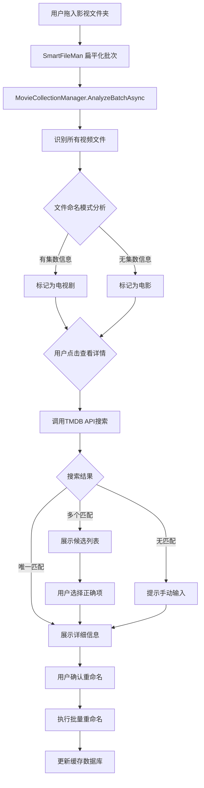

# MovieCollectionManager 项目开发说明书

> **文档版本**：v1.0
> **编写日期**：2026-03-19
> **项目名称**：MovieCollectionManager
> **项目类型**：SmartFileMan 插件
> **目标用户**：需要整理电视剧、电影等影视合集的用户

---

## 1. 项目概述

### 1.1 项目背景

SmartFileMan 是一个模块化的智能文件管理系统，支持插件扩展机制。用户在实际使用中，需要整理下载的电视剧、电影等影视文件，手动重命名费时费力，且难以获取影视的详细信息。

本插件旨在自动化处理影视文件的识别、重命名和信息展示，提升用户体验。

### 1.2 核心目标

| 功能模块 | 目标描述 |
|---------|---------|
| 自动重命名 | 根据集数自动将文件重命名为 `标题 SxxExx` 格式 |
| TMDB信息获取 | 通过 TMDB API 获取影视的完整信息（海报、简介、评分、演员、导演、季/集详情） |
| 文件管理 | 扫描、识别、整理影视文件夹，支持电视剧整季处理 |
| 信息展示 | 在独立页面展示影视详情，支持海报预览 |

### 1.3 用户画像

- **主要用户**：下载电视剧、电影并有整理习惯的用户
- **使用场景**：
  - 下载完整季的电视剧后，自动识别并重命名
  - 查看影视详细信息（演员、剧情、评分）
  - 整理混乱的影视文件库

### 1.4 术语定义

| 术语 | 定义 |
|-----|------|
| TMDB | The Movie Database，一个免费的影视数据库API |
| SxxExx | 季-集格式，如 S01E02 表示第1季第2集 |
| BatchContext | SmartFileMan 提供的批处理上下文对象 |
| RouteProposal | 插件竞价返回的目标路径提案 |
| LiteDB | SmartFileMan 使用的轻量级NoSQL数据库 |

---

## 2. 功能需求规格

### 2.1 功能清单（含优先级）

| 功能编号 | 功能名称 | 优先级 | 描述 |
|---------|---------|-------|------|
| F01 | 影视文件识别 | P0 | 识别视频文件（.mkv, .mp4, .avi, .wmv, .mov） |
| F02 | 集数提取 | P0 | 从文件名中提取集数信息（ S01E01 或 01x01 格式） |
| F03 | 自动重命名 | P0 | 按 `标题 SxxExx` 格式重命名文件 |
| F04 | TMDB搜索 | P0 | 根据文件名/文件夹名搜索TMDB影视信息 |
| F05 | 信息缓存 | P1 | 缓存已查询的TMDB信息，避免重复请求 |
| F06 | 详情页面 | P0 | 独立页面展示影视完整信息 |
| F07 | 手动匹配 | P1 | 搜索结果不准确时，用户手动选择正确影视 |
| F08 | 批量处理 | P0 | 支持整季文件一次性处理 |
| F09 | 配置管理 | P2 | 用户配置TMDB API Key、默认重命名模板 |

### 2.2 用户故事

#### 场景一：电视剧整季整理
```
作为用户，当我下载完一整季电视剧后，
我希望插件能自动识别每集并重命名为"标题 S01Exx"格式，
以便我的媒体库整洁有序。
```

#### 场景二：查看影视详情
```
作为用户，当我想要了解某部影视的详细信息时，
我希望点击文件后能看到海报、剧情简介、演员阵容、评分等，
帮助我决定是否保留或删除。
```

#### 场景三：手动修正匹配
```
作为用户，当插件自动匹配错误时，
我希望能够手动搜索并选择正确的影视条目，
确保信息准确无误。
```

### 2.3 业务流程图



### 2.4 页面清单

| 页面名称 | 路由/标识 | 功能描述 |
|---------|----------|---------|
| 影视详情页 | /movie/{id} | 展示单部影视的完整信息 |
| 搜索结果页 | /search | 展示TMDB搜索结果列表 |
| 设置页 | /settings | 配置API Key、重命名模板 |
| 批量处理页 | /batch | 展示待处理的文件列表 |

---

## 3. 技术架构设计

### 3.1 技术栈选型

| 技术 | 选择 | 选型理由 |
|-----|------|---------|
| 开发语言 | C# | SmartFileMan SDK 基于 .NET |
| 目标框架 | .NET 10 | 与 SmartFileMan 主程序一致 |
| UI框架 | .NET MAUI | SmartFileMan App 使用 MAUI |
| HTTP客户端 | HttpClient | TMDB API 调用 |
| JSON解析 | System.Text.Json | .NET 内置，高性能 |
| 图像加载 | Stream 转 ImageSource | MAUI 原生支持 |
| 数据库 | LiteDB | SmartFileMan 提供的插件存储 |
| API | TMDB v3 | 免费的影视数据库API |

### 3.2 系统架构图

```
┌─────────────────────────────────────────────────────────────┐
│                    SmartFileMan App                         │
│  ┌───────────────────────────────────────────────────────┐  │
│  │                  PluginManager                         │  │
│  │  ┌─────────────────────────────────────────────────┐   │  │
│  │  │         MovieCollectionManager 插件              │   │  │
│  │  │  ┌─────────────┐  ┌─────────────┐  ┌────────┐  │   │  │
│  │  │  │ BatchModule │  │ TMDBService │  │ UI     │  │   │  │
│  │  │  │             │  │             │  │ Module │  │   │  │
│  │  │  │ - Analyze   │  │ - Search    │  │        │  │   │  │
│  │  │  │ - Propose   │  │ - GetDetail │  │ - View │  │   │  │
│  │  │  │ - Rename    │  │ - Cache     │  │ - Page │  │   │  │
│  │  │  └─────────────┘  └─────────────┘  └────────┘  │   │  │
│  │  │         │                  │            │      │   │  │
│  │  │         └──────────────────┼────────────┘      │   │  │
│  │  │                            │                    │   │  │
│  │  │                    ┌───────┴───────┐           │   │  │
│  │  │                    │  LiteDB Cache │           │   │  │
│  │  │                    └───────────────┘           │   │  │
│  │  └─────────────────────────────────────────────────┘   │  │
│  └───────────────────────────────────────────────────────┘  │
└─────────────────────────────────────────────────────────────┘
                              │
                              ▼
                    ┌─────────────────┐
                    │   TMDB API      │
                    │   (External)    │
                    └─────────────────┘
```

### 3.3 数据流设计

```
┌──────────────┐    ┌──────────────┐    ┌──────────────┐
│  FileEntry  │───▶│  AnalyzeBatch │───▶│  FileIndex   │
│  (原始文件)   │    │  (分析批次)    │    │  (文件索引)   │
└──────────────┘    └──────────────┘    └──────┬───────┘
                                                │
                                                ▼
┌──────────────┐    ┌──────────────┐    ┌──────────────┐
│ TMDB API    │◀───│  Search       │◀───│  MediaInfo   │
│ (影视数据)   │    │  (搜索匹配)    │    │  (媒体信息)   │
└──────┬───────┘    └──────────────┘    └──────┬───────┘
       │                                         │
       │                                         ▼
       │                               ┌─────────────────┐
       │                               │  RenameProposal │
       │                               │  (重命名提案)    │
       │                               └────────┬────────┘
       │                                        │
       ▼                                        ▼
┌──────────────┐                        ┌──────────────┐
│  DetailPage  │                        │  FileSystem  │
│  (详情页)    │                        │  (文件操作)   │
└──────────────┘                        └──────────────┘
```

### 3.4 模块划分

| 模块名称 | 职责 | 公开API |
|---------|------|--------|
| `BatchModule` | 批次分析、文件识别、集数提取 | `AnalyzeBatch()`, `ExtractEpisodeInfo()` |
| `TMDBService` | TMDB API 调用、数据获取 | `SearchAsync()`, `GetDetailsAsync()` |
| `CacheService` | TMDB数据缓存、数据库操作 | `GetCached()`, `SaveToCache()` |
| `RenameService` | 生成重命名提案、执行重命名 | `GenerateProposal()`, `ExecuteRename()` |
| `UIModule` | MAUI页面、视图组件 | `GetDetailView()`, `GetSettingsView()` |

---

## 4. 详细设计规格

### 4.1 数据模型定义

```csharp
/// <summary>
/// 影视媒体信息
/// Media information for movies and TV shows
/// </summary>
public class MediaInfo
{
    /// <summary>TMDB ID</summary>
    public int TmdbId { get; set; }

    /// <summary>媒体类型：movie 或 tv</summary>
    public string MediaType { get; set; } = "movie";

    /// <summary>标题</summary>
    public string Title { get; set; } = string.Empty;

    /// <summary>原标题</summary>
    public string OriginalTitle { get; set; } = string.Empty;

    /// <summary>简介</summary>
    public string Overview { get; set; } = string.Empty;

    /// <summary>海报路径（本地缓存）</summary>
    public string? PosterPath { get; set; }

    /// <summary>背景图路径</summary>
    public string? BackdropPath { get; set; }

    /// <summary>评分（0-10）</summary>
    public double VoteAverage { get; set; }

    /// <summary>投票人数</summary>
    public int VoteCount { get; set; }

    /// <summary>上映/首播日期</summary>
    public DateTime? ReleaseDate { get; set; }

    /// <summary>电影片长（分钟）</summary>
    public int? Runtime { get; set; }

    /// <summary>电视剧总季数</summary>
    public int? NumberOfSeasons { get; set; }

    /// <summary>电视剧总集数</summary>
    public int? NumberOfEpisodes { get; set; }

    /// <summary>类型列表</summary>
    public List<string> Genres { get; set; } = new();

    /// <summary>创作国家</summary>
    public List<string> ProductionCountries { get; set; } = new();

    /// <summary>导演列表</summary>
    public List<string> Directors { get; set; } = new();

    /// <summary>演员列表（前10位）</summary>
    public List<CastMember> Cast { get; set; } = new();

    /// <summary>创建时间</summary>
    public DateTime CreatedAt { get; set; } = DateTime.UtcNow;
}

/// <summary>
/// 演员信息
/// Cast member information
/// </summary>
public class CastMember
{
    public int Id { get; set; }
    public string Name { get; set; } = string.Empty;
    public string Character { get; set; } = string.Empty;
    public string? ProfilePath { get; set; }
}

/// <summary>
/// 剧集信息（用于电视剧）
/// Episode information for TV shows
/// </summary>
public class EpisodeInfo
{
    /// <summary>所属季号</summary>
    public int SeasonNumber { get; set; }

    /// <summary>集号</summary>
    public int EpisodeNumber { get; set; }

    /// <summary>集标题</summary>
    public string Name { get; set; } = string.Empty;

    /// <summary>集简介</summary>
    public string Overview { get; set; } = string.Empty;

    /// <summary>海报路径</summary>
    public string? StillPath { get; set; }

    /// <summary>上映日期</summary>
    public DateTime? AirDate { get; set; }
}

/// <summary>
/// 电视剧季信息
/// Season information for TV shows
/// </summary>
public class SeasonInfo
{
    public int SeasonNumber { get; set; }
    public string Name { get; set; } = string.Empty;
    public string Overview { get; set; } = string.Empty;
    public string? PosterPath { get; set; }
    public int EpisodeCount { get; set; }
    public List<EpisodeInfo> Episodes { get; set; } = new();
}

/// <summary>
/// 文件索引记录
/// File index record for tracked media files
/// </summary>
public class MediaFileIndex
{
    /// <summary>唯一标识符</summary>
    public string Id { get; set; } = Guid.NewGuid().ToString();

    /// <summary>原始文件路径</summary>
    public string OriginalPath { get; set; } = string.Empty;

    /// <summary>原始文件名</summary>
    public string OriginalName { get; set; } = string.Empty;

    /// <summary>当前文件路径（重命名后）</summary>
    public string? CurrentPath { get; set; }

    /// <summary>媒体类型</summary>
    public string MediaType { get; set; } = "movie";

    /// <summary>关联的TMDB ID</summary>
    public int? TmdbId { get; set; }

    /// <summary>季号（电视剧）</summary>
    public int? SeasonNumber { get; set; }

    /// <summary>集号（电视剧）</summary>
    public int? EpisodeNumber { get; set; }

    /// <summary>文件哈希（用于去重）</summary>
    public string? FileHash { get; set; }

    /// <summary>处理状态</summary>
    public ProcessingStatus Status { get; set; } = ProcessingStatus.Pending;

    /// <summary>创建时间</summary>
    public DateTime CreatedAt { get; set; } = DateTime.UtcNow;

    /// <summary>更新时间</summary>
    public DateTime UpdatedAt { get; set; } = DateTime.UtcNow;
}

/// <summary>
/// 处理状态枚举
/// Processing status enumeration
/// </summary>
public enum ProcessingStatus
{
    /// <summary>待处理</summary>
    Pending = 0,

    /// <summary>已识别</summary>
    Recognized = 1,

    /// <summary>已匹配</summary>
    Matched = 2,

    /// <summary>已重命名</summary>
    Renamed = 3,

    /// <summary>处理失败</summary>
    Failed = 4
}

/// <summary>
/// TMDB缓存记录
/// TMDB cache record
/// </summary>
public class TmdbCacheEntry
{
    public string CacheKey { get; set; } = string.Empty;
    public int TmdbId { get; set; }
    public string MediaType { get; set; } = "movie";
    public MediaInfo? Data { get; set; }
    public DateTime CachedAt { get; set; } = DateTime.UtcNow;
    public DateTime ExpiresAt { get; set; }
}

/// <summary>
/// 重命名提案
/// Rename proposal for file operations
/// </summary>
public class RenameProposal
{
    /// <summary>原始文件路径</summary>
    public string OriginalPath { get; set; } = string.Empty;

    /// <summary>原始文件名</summary>
    public string OriginalName { get; set; } = string.Empty;

    /// <summary>提案的新名称（不含路径）</summary>
    public string NewName { get; set; } = string.Empty;

    /// <summary>提案的新路径（含文件名）</summary>
    public string NewPath { get; set; } = string.Empty;

    /// <summary>关联的媒体信息</summary>
    public MediaInfo? MediaInfo { get; set; }

    /// <summary>提案得分（0-100）</summary>
    public int Score { get; set; }

    /// <summary>提案理由</summary>
    public string Reason { get; set; } = string.Empty;
}

/// <summary>
/// 插件配置
/// Plugin configuration settings
/// </summary>
public class PluginConfig
{
    /// <summary>TMDB API Key</summary>
    public string TmdbApiKey { get; set; } = string.Empty;

    /// <summary>默认重命名模板</summary>
    public string RenameTemplate { get; set; } = "{title} S{season:00}E{episode:00}";

    /// <summary>是否自动处理</summary>
    public bool AutoProcess { get; set; } = false;

    /// <summary>目标文件夹（为空则原地重命名）</summary>
    public string? TargetFolder { get; set; }

    /// <summary>语言偏好</summary>
    public string Language { get; set; } = "zh-CN";
}
```

### 4.2 组件清单与Props定义

#### 4.2.1 DetailPage (详情页)

```csharp
/// <summary>
/// 影视详情页
/// Media detail page showing full information
/// </summary>
public class DetailPage : ContentView
{
    /// <summary>关联的媒体信息</summary>
    public static readonly BindableProperty MediaInfoProperty =
        BindableProperty.Create(nameof(MediaInfo), typeof(MediaInfo), typeof(DetailPage));

    public MediaInfo? MediaInfo
    {
        get => (MediaInfo?)GetValue(MediaInfoProperty);
        set => SetValue(MediaInfoProperty, value);
    }

    /// <summary>剧集列表（用于电视剧）</summary>
    public static readonly BindableProperty SeasonsProperty =
        BindableProperty.Create(nameof(Seasons), typeof(List<SeasonInfo>), typeof(DetailPage));

    public List<SeasonInfo>? Seasons
    {
        get => (List<SeasonInfo>?)GetValue(SeasonsProperty);
        set => SetValue(SeasonsProperty, value);
    }

    /// <summary>加载状态</summary>
    public static readonly BindableProperty IsLoadingProperty =
        BindableProperty.Create(nameof(IsLoading), typeof(bool), typeof(DetailPage), false);

    public bool IsLoading
    {
        get => (bool)GetValue(IsLoadingProperty);
        set => SetValue(IsLoadingProperty, value);
    }
}
```

#### 4.2.2 MediaCard (媒体卡片组件)

```csharp
/// <summary>
/// 媒体卡片组件
/// Media card component for list display
/// </summary>
public class MediaCard : ContentView
{
    /// <summary>媒体标题</summary>
    public static readonly BindableProperty TitleProperty =
        BindableProperty.Create(nameof(Title), typeof(string), typeof(MediaCard));

    public string Title
    {
        get => (string)GetValue(TitleProperty);
        set => SetValue(TitleProperty, value);
    }

    /// <summary>海报图片源</summary>
    public static readonly BindableProperty PosterSourceProperty =
        BindableProperty.Create(nameof(PosterSource), typeof(ImageSource), typeof(MediaCard));

    public ImageSource? PosterSource
    {
        get => (ImageSource?)GetValue(PosterSourceProperty);
        set => SetValue(PosterSourceProperty, value);
    }

    /// <summary>评分显示</summary>
    public static readonly BindableProperty RatingProperty =
        BindableProperty.Create(nameof(Rating), typeof(double), typeof(MediaCard));

    public double Rating
    {
        get => (double)GetValue(RatingProperty);
        set => SetValue(RatingProperty, value);
    }

    /// <summary>媒体类型标签</summary>
    public static readonly BindableProperty MediaTypeLabelProperty =
        BindableProperty.Create(nameof(MediaTypeLabel), typeof(string), typeof(MediaCard), "电影");

    public string MediaTypeLabel
    {
        get => (string)GetValue(MediaTypeLabelProperty);
        set => SetValue(MediaTypeLabelProperty, value);
    }

    /// <summary>点击事件</summary>
    public event EventHandler<MediaInfo>? CardClicked;
}
```

#### 4.2.3 EpisodeListItem (剧集列表项)

```csharp
/// <summary>
/// 剧集列表项组件
/// Episode list item component
/// </summary>
public class EpisodeListItem : ContentView
{
    /// <summary>剧集信息</summary>
    public static readonly BindableProperty EpisodeProperty =
        BindableProperty.Create(nameof(Episode), typeof(EpisodeInfo), typeof(EpisodeListItem));

    public EpisodeInfo Episode
    {
        get => (EpisodeInfo)GetValue(EpisodeProperty);
        set => SetValue(EpisodeProperty, value);
    }

    /// <summary>是否已处理</summary>
    public static readonly BindableProperty IsProcessedProperty =
        BindableProperty.Create(nameof(IsProcessed), typeof(bool), typeof(EpisodeListItem), false);

    public bool IsProcessed
    {
        get => (bool)GetValue(IsProcessedProperty);
        set => SetValue(IsProcessedProperty, value);
    }

    /// <summary>选中事件</summary>
    public event EventHandler<EpisodeInfo>? EpisodeSelected;
}
```

#### 4.2.4 SearchResultCard (搜索结果卡片)

```csharp
/// <summary>
/// 搜索结果卡片组件
/// Search result card component
/// </summary>
public class SearchResultCard : ContentView
{
    /// <summary>搜索结果媒体信息</summary>
    public static readonly BindableProperty ResultProperty =
        BindableProperty.Create(nameof(Result), typeof(MediaInfo), typeof(SearchResultCard));

    public MediaInfo Result
    {
        get => (MediaInfo)GetValue(ResultProperty);
        set => SetValue(ResultProperty, value);
    }

    /// <summary>匹配度分数</summary>
    public static readonly BindableProperty MatchScoreProperty =
        BindableProperty.Create(nameof(MatchScore), typeof(int), typeof(SearchResultCard), 0);

    public int MatchScore
    {
        get => (int)GetValue(MatchScoreProperty);
        set => SetValue(MatchScoreProperty, value);
    }

    /// <summary>选中作为正确匹配</summary>
    public event EventHandler<MediaInfo>? Selected;
}
```

### 4.3 状态管理设计

```csharp
/// <summary>
/// 插件状态管理器
/// Plugin state management
/// </summary>
public class PluginState
{
    /// <summary>当前选中的媒体信息</summary>
    public MediaInfo? CurrentMedia { get; set; }

    /// <summary>当前批次的文件索引</summary>
    public List<MediaFileIndex> BatchFiles { get; set; } = new();

    /// <summary>搜索结果列表</summary>
    public List<MediaInfo> SearchResults { get; set; } = new();

    /// <summary>电视剧季信息</summary>
    public List<SeasonInfo> Seasons { get; set; } = new();

    /// <summary>加载状态</summary>
    public bool IsLoading { get; set; }

    /// <summary>错误消息</summary>
    public string? ErrorMessage { get; set; }

    /// <summary>插件配置</summary>
    public PluginConfig Config { get; set; } = new();
}

/// <summary>
/// 插件状态访问器
/// Provides thread-safe access to plugin state
/// </summary>
public interface IStateAccessor
{
    PluginState State { get; }
    void UpdateState(Action<PluginState> update);
    event EventHandler<PluginState>? StateChanged;
}
```

### 4.4 TMDB API接口定义

```csharp
/// <summary>
/// TMDB API 服务接口
/// TMDB API service interface
/// </summary>
public interface ITmdbService
{
    /// <summary>
    /// 搜索影视
    /// Search for movies or TV shows
    /// </summary>
    /// <param name="query">搜索关键词</param>
    /// <param name="mediaType">媒体类型：movie, tv, 或 all</param>
    /// <returns>搜索结果列表</returns>
    Task<List<MediaInfo>> SearchAsync(string query, string mediaType = "all");

    /// <summary>
    /// 获取电影详情
    /// Get movie details by ID
    /// </summary>
    /// <param name="tmdbId">TMDB电影ID</param>
    /// <returns>电影详细信息</returns>
    Task<MediaInfo?> GetMovieDetailsAsync(int tmdbId);

    /// <summary>
    /// 获取电视剧详情
    /// Get TV show details by ID
    /// </summary>
    /// <param name="tmdbId">TMDB电视剧ID</param>
    /// <returns>电视剧详细信息</returns>
    Task<MediaInfo?> GetTvDetailsAsync(int tmdbId);

    /// <summary>
    /// 获取电视剧季信息
    /// Get season details for a TV show
    /// </summary>
    /// <param name="tmdbId">TMDB电视剧ID</param>
    /// <param name="seasonNumber">季号</param>
    /// <returns>季详细信息</returns>
    Task<SeasonInfo?> GetSeasonDetailsAsync(int tmdbId, int seasonNumber);

    /// <summary>
    /// 下载并缓存图片
    /// Download and cache poster/backdrop image
    /// </summary>
    /// <param name="path">TMDB图片路径</param>
    /// <returns>本地缓存路径</returns>
    Task<string?> DownloadImageAsync(string path);
}
```

#### TMDB API 端点参考

| 功能 | HTTP方法 | 端点 | 描述 |
|-----|---------|------|------|
| 搜索 | GET | `/search/multi` | 多类型搜索 |
| 电影详情 | GET | `/movie/{id}` | 获取电影详细信息 |
| 电视剧详情 | GET | `/tv/{id}` | 获取电视剧详细信息 |
| 季详情 | GET | `/tv/{id}/season/{season_number}` | 获取指定季信息 |
| 图片 | GET | `/t/p/{size}{path}` | 获取图片URL |

### 4.5 路由设计

插件通过 `IPluginUI` 接口提供以下视图：

| 视图 | 返回类型 | 描述 |
|-----|---------|------|
| 详情页 | `View` | 展示选中影视的完整信息 |
| 设置页 | `View` | 配置API Key和其他选项 |
| 搜索页 | `View` | 搜索结果列表页面 |

### 4.6 函数定义规范

#### 4.6.1 BatchModule

```csharp
/// <summary>
/// 批次分析模块
/// Batch analysis module for media file processing
/// </summary>
public class BatchModule
{
    /// <summary>
    /// 分析批次中的所有文件
    /// Analyze all files in the batch context
    /// </summary>
    /// <param name="context">SmartFileMan 批处理上下文</param>
    /// <returns>分析得到的文件索引列表</returns>
    /// <example>
    /// var indices = await batchModule.AnalyzeBatchAsync(context);
    /// </example>
    public Task<List<MediaFileIndex>> AnalyzeBatchAsync(BatchContext context);

    /// <summary>
    /// 从文件名提取集数信息
    /// Extract episode information from filename
    /// </summary>
    /// <param name="fileName">原始文件名</param>
    /// <returns>提取的集数信息，如果无法提取则返回null</returns>
    /// <example>
    /// var info = ExtractEpisodeInfo("Breaking.Bad.S01E01.mkv");
    /// // info.SeasonNumber == 1, info.EpisodeNumber == 1
    /// </example>
    public EpisodeInfo? ExtractEpisodeInfo(string fileName);

    /// <summary>
    /// 识别媒体类型
    /// Recognize media type (movie or TV show)
    /// </summary>
    /// <param name="fileName">文件名或文件夹名</param>
    /// <returns>"movie", "tv", 或 "unknown"</returns>
    public string RecognizeMediaType(string fileName);

    /// <summary>
    /// 生成清理后的搜索关键词
    /// Generate cleaned search keyword from filename
    /// </summary>
    /// <param name="fileName">原始文件名</param>
    /// <returns>清理后的搜索关键词</returns>
    public string GenerateSearchKeyword(string fileName);
}
```

#### 4.6.2 RenameService

```csharp
/// <summary>
    /// 重命名服务
    /// Rename service for media files
    /// </summary>
    public class RenameService
    {
        /// <summary>
        /// 生成重命名提案
        /// Generate rename proposals for batch files
        /// </summary>
        /// <param name="files">文件索引列表</param>
        /// <param name="mediaInfo">关联的媒体信息</param>
        /// <param name="template">重命名模板</param>
        /// <returns>重命名提案列表</returns>
        public List<RenameProposal> GenerateProposals(
            List<MediaFileIndex> files,
            MediaInfo mediaInfo,
            string template);

        /// <summary>
        /// 执行批量重命名
        /// Execute batch rename operation
        /// </summary>
        /// <param name="proposals">重命名提案列表</param>
        /// <returns>成功重命名的数量</returns>
        public async Task<int> ExecuteBatchRenameAsync(List<RenameProposal> proposals);

        /// <summary>
        /// 格式化集数标题
        /// Format episode title with season and episode number
        /// </summary>
        /// <param name="template">模板字符串</param>
        /// <param name="mediaInfo">媒体信息</param>
        /// <param name="episode">剧集信息</param>
        /// <returns>格式化后的文件名</returns>
        public string FormatEpisodeTitle(
            string template,
            MediaInfo mediaInfo,
            EpisodeInfo episode);

        /// <summary>
        /// 获取文件的正确扩展名
        /// Get the correct file extension
        /// </summary>
        /// <param name="originalPath">原始文件路径</param>
        /// <returns>文件扩展名（含点）</returns>
        public string GetExtension(string originalPath);
    }
```

#### 4.6.3 CacheService

```csharp
/// <summary>
/// 缓存服务
/// Cache service for TMDB data persistence
/// </summary>
public class CacheService
{
    /// <summary>
    /// 获取缓存的媒体信息
    /// Get cached media information
    /// </summary>
    /// <param name="cacheKey">缓存键</param>
    /// <returns>缓存的媒体信息，如果不存在或已过期返回null</returns>
    public MediaInfo? GetCached(string cacheKey);

    /// <summary>
    /// 保存媒体信息到缓存
    /// Save media information to cache
    /// </summary>
    /// <param name="cacheKey">缓存键</param>
    /// <param name="mediaInfo">媒体信息</param>
    /// <param name="ttl">缓存有效期（小时）</param>
    public void SaveToCache(string cacheKey, MediaInfo mediaInfo, int ttl = 168);

    /// <summary>
    /// 获取文件索引
    /// Get file index by path
    /// </summary>
    /// <param name="path">文件路径</param>
    /// <returns>文件索引，如果不存在返回null</returns>
    public MediaFileIndex? GetFileIndex(string path);

    /// <summary>
    /// 保存或更新文件索引
    /// Save or update file index
    /// </summary>
    /// <param name="index">文件索引</param>
    public void SaveFileIndex(MediaFileIndex index);

    /// <summary>
    /// 清除过期缓存
    /// Clear expired cache entries
    /// </summary>
    public void ClearExpiredCache();

    /// <summary>
    /// 生成缓存键
    /// Generate cache key
    /// </summary>
    /// <param name="tmdbId">TMDB ID</param>
    /// <param name="mediaType">媒体类型</param>
    /// <returns>缓存键字符串</returns>
    public string GenerateCacheKey(int tmdbId, string mediaType);
}
```

---

## 5. UI/UX设计规范

### 5.1 设计系统

#### 5.1.1 深色主题色彩规范

| 用途 | 颜色名称 | HEX值 | 使用场景 |
|-----|---------|-------|---------|
| 主背景 | Dark Background | #1A1A2E | 页面主背景 |
| 次背景 | Card Background | #16213E | 卡片、面板背景 |
| 第三背景 | Elevated Surface | #0F3460 | 悬浮元素、对话框 |
| 主强调色 | Primary Accent | #E94560 | 主要按钮、链接、选中状态 |
| 次强调色 | Secondary Accent | #533483 | 次要强调、图标 |
| 主文字 | Primary Text | #FFFFFF | 标题、重要文字 |
| 次文字 | Secondary Text | #B0B0B0 | 描述文字、次要信息 |
| 分割线 | Divider | #2D2D44 | 分隔线、边框 |
| 成功色 | Success | #4CAF50 | 成功状态 |
| 警告色 | Warning | #FF9800 | 警告状态 |
| 错误色 | Error | #F44336 | 错误状态 |

#### 5.1.2 字体规范

| 用途 | 字体 | 大小 | 字重 |
|-----|------|------|------|
| 页面标题 | Segoe UI | 28sp | Bold |
| 卡片标题 | Segoe UI | 18sp | SemiBold |
| 正文 | Segoe UI | 14sp | Regular |
| 副标题 | Segoe UI | 12sp | Regular |
| 标签 | Segoe UI | 11sp | Medium |

#### 5.1.3 间距规范

| 名称 | 大小 | 使用场景 |
|-----|------|---------|
| xs | 4px | 紧凑排列元素间距 |
| sm | 8px | 组件内部间距 |
| md | 16px | 组件之间间距 |
| lg | 24px | 区块之间间距 |
| xl | 32px | 页面边距 |
| xxl | 48px | 大区块分隔 |

#### 5.1.4 圆角规范

| 名称 | 大小 | 使用场景 |
|-----|------|---------|
| small | 4px | 小按钮、标签 |
| medium | 8px | 卡片、输入框 |
| large | 12px | 模态框、大卡片 |

### 5.2 页面线框图/原型描述

#### 5.2.1 影视详情页 (DetailPage)

```
┌─────────────────────────────────────────────────────────────┐
│  ← 返回                              ⚙️ 设置        [操作▼]  │
├─────────────────────────────────────────────────────────────┤
│                                                             │
│  ┌──────────────┐                                           │
│  │              │  Breaking Bad                              │
│  │   海报图片    │  Original Title: Breaking Bad             │
│  │   (Poster)   │                                           │
│  │              │  ⭐ 9.5 (12000+ votes)    🏷️ 剧情/犯罪     │
│  │              │                                           │
│  └──────────────┘  📅 2008-01-20 至 2013-07-15              │
│                    ⏱️ 共62集 / 5季                          │
│                                                             │
├─────────────────────────────────────────────────────────────┤
│  剧情简介                                                     │
│  ─────────────────────────────────────────────────────────  │
│  A high school chemistry teacher diagnosed with inopera...  │
│                                                             │
├─────────────────────────────────────────────────────────────┤
│  演员阵容                                                     │
│  ─────────────────────────────────────────────────────────  │
│  ┌────┐ ┌────┐ ┌────┐ ┌────┐ ┌────┐ ┌────┐               │
│  │ 🎭 │ │ 🎭 │ │ 🎭 │ │ 🎭 │ │ 🎭 │ │ ▶️ │               │
│  │    │ │    │ │    │ │    │ │    │ │    │               │
│  │Bryan│ │Anna│ │Dean│ │Bob  │ │Gus │ │更多│               │
│  └────┘ └────┘ └────┘ └────┘ └────┘ └────┘               │
│                                                             │
├─────────────────────────────────────────────────────────────┤
│  剧集列表                                                     │
│  ─────────────────────────────────────────────────────────  │
│  Season 1 ▼                    [全选] [重命名选中]          │
│  ┌─────────────────────────────────────────────────────┐    │
│  │ ☑ S01E01 │ Pilot              │ 2008-01-20 │  ✓    │    │
│  ├─────────────────────────────────────────────────────┤    │
│  │ ☑ S01E02 │ Cat's in the Bag...│ 2008-01-20 │  ✓    │    │
│  ├─────────────────────────────────────────────────────┤    │
│  │ ☐ S01E03 │ ...                │ ...        │  ✓    │    │
│  └─────────────────────────────────────────────────────┘    │
│                                                             │
└─────────────────────────────────────────────────────────────┘
```

#### 5.2.2 搜索结果页 (SearchResultPage)

```
┌─────────────────────────────────────────────────────────────┐
│  ← 返回                                    🔍 [搜索...]     │
├─────────────────────────────────────────────────────────────┤
│  搜索: "breaking bad"                              共5条结果 │
├─────────────────────────────────────────────────────────────┤
│  匹配度排序 ▼                                                │
│                                                             │
│  ┌─────────────────────────────────────────────────────┐    │
│  │ ┌────┐                                               │    │
│  │ │ 🎬 │  Breaking Bad                     ⭐ 9.5      │    │
│  │ │海报│  绝命毒师 (中文名)                              │    │
│  │ └────┘  2008 | 剧情/犯罪 | 5季62集                    │    │
│  │         [选择此匹配]                                  │    │
│  └─────────────────────────────────────────────────────┘    │
│                                                             │
│  ┌─────────────────────────────────────────────────────┐    │
│  │ ┌────┐                                               │    │
│  │ │ 🎬 │  Better Call Saul               ⭐ 8.8       │    │
│  │ │海报│  风骚律师                                      │    │
│  │ └────┘  2015 | 剧情/犯罪 | 6季                        │    │
│  │         [选择此匹配]                                  │    │
│  └─────────────────────────────────────────────────────┘    │
│                                                             │
└─────────────────────────────────────────────────────────────┘
```

#### 5.2.3 设置页 (SettingsPage)

```
┌─────────────────────────────────────────────────────────────┐
│  ← 返回                              ⚙️ 设置               │
├─────────────────────────────────────────────────────────────┤
│                                                             │
│  TMDB API 配置                                              │
│  ─────────────────────────────────────────────────────────  │
│                                                             │
│  API Key                                                   │
│  ┌─────────────────────────────────────────────────────┐  │
│  │ 请输入您的TMDB API Key                               │  │
│  └─────────────────────────────────────────────────────┘  │
│  ℹ️ 请访问 https://www.themoviedb.org/settings/api        │
│     获取您的API Key                                        │
│                                                             │
│  [保存配置]                                                 │
│                                                             │
├─────────────────────────────────────────────────────────────┤
│  重命名设置                                                  │
│  ─────────────────────────────────────────────────────────  │
│                                                             │
│  重命名模板                                                 │
│  ┌─────────────────────────────────────────────────────┐  │
│  │ {title} S{season:00}E{episode:00}                   │  │
│  └─────────────────────────────────────────────────────┘  │
│                                                             │
│  预览: Breaking Bad S01E01                                  │
│                                                             │
│  目标文件夹                                                 │
│  ┌─────────────────────────────────────────────────────┐  │
│  │ D:\Movies\TV Shows                                  │  │
│  └─────────────────────────────────────────────────────┘  │
│  ℹ️ 为空则原地重命名                                        │
│                                                             │
├─────────────────────────────────────────────────────────────┤
│  [清除缓存]                              [导出配置]          │
│                                                             │
└─────────────────────────────────────────────────────────────┘
```

### 5.3 交互设计规范

| 交互场景 | 行为描述 | 视觉反馈 |
|---------|---------|---------|
| 按钮点击 | 执行操作 | 按钮缩放至0.95，持续100ms |
| 列表项选择 | 切换选中状态 | 背景色变为强调色(20%透明度) |
| 加载中 | 异步请求TMDB | 显示旋转加载指示器 |
| 搜索 | 输入后自动搜索 | 300ms防抖后执行搜索 |
| 重命名成功 | 文件操作完成 | 显示绿色对勾提示 |
| 错误 | 操作失败 | 显示红色错误提示，2秒后消失 |

### 5.4 响应式断点

| 断点 | 宽度 | 布局调整 |
|-----|------|---------|
| Compact | < 600px | 单列布局，卡片全宽 |
| Standard | 600-900px | 双列网格 |
| Expanded | > 900px | 三列网格，侧边栏详情 |

---

## 6. 项目结构规范

### 6.1 目录结构

```
MovieCollectionManager/
├── MovieCollectionManager.csproj
├── MovieCollectionManager.snk
├── README.md
│
├── src/
│   │
│   ├── Models/
│   │   ├── MediaInfo.cs
│   │   ├── MediaFileIndex.cs
│   │   ├── EpisodeInfo.cs
│   │   ├── SeasonInfo.cs
│   │   ├── CastMember.cs
│   │   ├── TmdbCacheEntry.cs
│   │   ├── RenameProposal.cs
│   │   ├── PluginConfig.cs
│   │   └── PluginState.cs
│   │
│   ├── Services/
│   │   ├── ITmdbService.cs
│   │   ├── TmdbService.cs
│   │   ├── ICacheService.cs
│   │   ├── CacheService.cs
│   │   ├── IRenameService.cs
│   │   ├── RenameService.cs
│   │   ├── IBatchModule.cs
│   │   └── BatchModule.cs
│   │
│   ├── ViewModels/
│   │   ├── DetailPageViewModel.cs
│   │   ├── SearchResultViewModel.cs
│   │   ├── SettingsViewModel.cs
│   │   └── BatchProcessViewModel.cs
│   │
│   ├── Views/
│   │   ├── DetailPage.xaml
│   │   ├── DetailPage.xaml.cs
│   │   ├── SearchResultPage.xaml
│   │   ├── SearchResultPage.xaml.cs
│   │   ├── SettingsPage.xaml
│   │   ├── SettingsPage.xaml.cs
│   │   └── Components/
│   │       ├── MediaCard.xaml
│   │       ├── MediaCard.xaml.cs
│   │       ├── EpisodeListItem.xaml
│   │       ├── EpisodeListItem.xaml.cs
│   │       ├── SearchResultCard.xaml
│   │       └── SearchResultCard.xaml.cs
│   │
│   ├── Converters/
│   │   ├── NullToBoolConverter.cs
│   │   ├── RatingToStarsConverter.cs
│   │   └── DateFormatConverter.cs
│   │
│   └── Resources/
│       ├── Styles.xaml
│       └── Colors.xaml
│
├── tests/
│   └── MovieCollectionManager.Tests/
│       ├── BatchModuleTests.cs
│       ├── RenameServiceTests.cs
│       ├── TmdbServiceTests.cs
│       └── CacheServiceTests.cs
│
└── docs/
    ├── API_REFERENCE.md
    └── TMDB_INTEGRATION.md
```

### 6.2 文件命名规范

| 类型 | 规范 | 示例 |
|-----|------|------|
| 源文件 | PascalCase | `TmdbService.cs`, `MediaInfo.cs` |
| XAML视图 | PascalCase | `DetailPage.xaml`, `MediaCard.xaml` |
| 测试文件 | `<ClassName>Tests.cs` | `BatchModuleTests.cs` |
| 接口 | `I` + PascalCase | `ITmdbService.cs` |
| 视图模型 | `<PageName>ViewModel.cs` | `DetailPageViewModel.cs` |

### 6.3 代码组织原则

1. **单一职责**：每个类只负责一个功能领域
2. **依赖注入**：服务通过构造函数注入
3. **异步优先**：所有IO操作使用async/await
4. **空值安全**：使用可空类型和空值检查

### 6.4 依赖列表

```xml
<!-- MovieCollectionManager.csproj -->
<Project Sdk="Microsoft.NET.Sdk">
  <PropertyGroup>
    <TargetFramework>net10.0-windows10.0.19041.0</TargetFramework>
    <Nullable>enable</Nullable>
    <ImplicitUsings>enable</ImplicitUsings>
  </PropertyGroup>

  <ItemGroup>
    <PackageReference Include="Microsoft.Extensions.Http" Version="10.0.0" />
    <PackageReference Include="Microsoft.Extensions.Caching.Memory" Version="10.0.0" />
    <PackageReference Include="System.Text.Json" Version="10.0.0" />
  </ItemGroup>

  <ItemGroup>
    <ProjectReference Include="..\..\src\SmartFileMan.Contracts\SmartFileMan.Contracts.csproj" />
    <ProjectReference Include="..\..\src\SmartFileMan.Sdk\SmartFileMan.Sdk.csproj" />
  </ItemGroup>
</Project>
```

---

## 7. 核心功能实现指南

### 7.1 功能A：自动重命名

#### 实现步骤

**步骤1：集数信息提取**

```csharp
/// <summary>
/// 从文件名提取集数信息的正则表达式
/// Regex patterns for extracting episode information
/// </summary>
private static readonly Regex[] EpisodePatterns = new[]
{
    // S01E01 或 S1E1 格式
    new Regex(@"S(\d{1,2})E(\d{1,2})", RegexOptions.IgnoreCase),
    // 01x01 格式
    new Regex(@"(\d{1,2})x(\d{1,2})", RegexOptions.IgnoreCase),
    // 第1季第1集 或 第1集 格式（中文）
    new Regex(@"第(\d+)季.*?第(\d+)集", RegexOptions.IgnoreCase),
    // [01] 和 [01] 格式
    new Regex(@"\[(\d{1,2})\].*?\[(\d{1,2})\]", RegexOptions.IgnoreCase),
};

/// <summary>
/// 提取集数信息
/// Extract episode information from filename
/// </summary>
public EpisodeInfo? ExtractEpisodeInfo(string fileName)
{
    foreach (var pattern in EpisodePatterns)
    {
        var match = pattern.Match(fileName);
        if (match.Success)
        {
            int.TryParse(match.Groups[1].Value, out int season);
            int.TryParse(match.Groups[2].Value, out int episode);
            return new EpisodeInfo
            {
                SeasonNumber = season,
                EpisodeNumber = episode
            };
        }
    }
    return null;
}
```

**步骤2：生成重命名提案**

```csharp
/// <summary>
/// 生成重命名提案
/// Generate rename proposals for batch files
/// </summary>
public List<RenameProposal> GenerateProposals(
    List<MediaFileIndex> files,
    MediaInfo mediaInfo,
    string template)
{
    var proposals = new List<RenameProposal>();
    var extension = Path.GetExtension(files.First().OriginalPath);

    foreach (var file in files.Where(f => f.EpisodeNumber.HasValue))
    {
        var episode = GetEpisodeInfo(mediaInfo, file.SeasonNumber!.Value, file.EpisodeNumber!.Value);
        var newName = FormatEpisodeTitle(template, mediaInfo, episode) + extension;
        var newPath = Path.Combine(
            Path.GetDirectoryName(file.OriginalPath) ?? string.Empty,
            newName);

        proposals.Add(new RenameProposal
        {
            OriginalPath = file.OriginalPath,
            OriginalName = file.OriginalName,
            NewName = newName,
            NewPath = newPath,
            MediaInfo = mediaInfo,
            Score = 95,
            Reason = $"匹配到 {mediaInfo.Title} 第{file.SeasonNumber}季第{file.EpisodeNumber}集"
        });
    }

    return proposals;
}

/// <summary>
/// 格式化集数标题
/// Format episode title using template
/// </summary>
public string FormatEpisodeTitle(string template, MediaInfo mediaInfo, EpisodeInfo episode)
{
    return template
        .Replace("{title}", mediaInfo.Title)
        .Replace("{season:00}", episode.SeasonNumber.ToString("00"))
        .Replace("{episode:00}", episode.EpisodeNumber.ToString("00"))
        .Replace("{season}", episode.SeasonNumber.ToString())
        .Replace("{episode}", episode.EpisodeNumber.ToString())
        .Replace("{episode_name}", episode.Name);
}
```

**步骤3：执行重命名**

```csharp
/// <summary>
/// 执行批量重命名
/// Execute batch rename operation
/// </summary>
public async Task<int> ExecuteBatchRenameAsync(
    List<RenameProposal> proposals,
    SafeContext safeContext)
{
    int successCount = 0;

    safeContext.BeginBatch("MovieCollection_Rename");

    foreach (var proposal in proposals)
    {
        try
        {
            var fileEntry = await GetFileEntryAsync(proposal.OriginalPath);
            if (fileEntry != null)
            {
                await safeContext.Rename(fileEntry, proposal.NewName);
                successCount++;
            }
        }
        catch (Exception ex)
        {
            System.Diagnostics.Debug.WriteLine($"重命名失败: {proposal.OriginalPath}, {ex.Message}");
        }
    }

    safeContext.CommitBatch();
    return successCount;
}
```

### 7.2 功能B：TMDB信息获取

#### 实现步骤

**步骤1：配置TMDB客户端**

```csharp
/// <summary>
/// TMDB服务实现
/// TMDB service implementation
/// </summary>
public class TmdbService : ITmdbService
{
    private readonly HttpClient _httpClient;
    private readonly string _apiKey;
    private readonly string _baseUrl = "https://api.themoviedb.org/3";
    private readonly string _imageBaseUrl = "https://image.tmdb.org/t/p";

    public TmdbService(string apiKey)
    {
        _apiKey = apiKey;
        _httpClient = new HttpClient();
        _httpClient.Timeout = TimeSpan.FromSeconds(30);
    }

    private Dictionary<string, string> GetCommonParams() => new()
    {
        ["api_key"] = _apiKey,
        ["language"] = "zh-CN"
    };
}
```

**步骤2：实现搜索功能**

```csharp
/// <summary>
/// 搜索影视
/// Search for movies or TV shows
/// </summary>
public async Task<List<MediaInfo>> SearchAsync(string query, string mediaType = "all")
{
    var results = new List<MediaInfo>();
    var url = $"{_baseUrl}/search/multi";

    var queryParams = GetCommonParams();
    queryParams["query"] = query;
    queryParams["include_adult"] = "false";

    var response = await _httpClient.GetAsync(AddQueryParams(url, queryParams));
    response.EnsureSuccessStatusCode();

    var json = await response.Content.ReadAsStringAsync();
    using var doc = JsonDocument.Parse(json);

    foreach (var element in doc.RootElement.GetProperty("results").EnumerateArray())
    {
        var type = element.GetProperty("media_type").GetString();
        if (type == "movie" || type == "tv")
        {
            results.Add(ParseMediaInfo(element, type));
        }
    }

    return results;
}
```

**步骤3：获取详情**

```csharp
/// <summary>
/// 获取电影详情
/// Get movie details by ID
/// </summary>
public async Task<MediaInfo?> GetMovieDetailsAsync(int tmdbId)
{
    var url = $"{_baseUrl}/movie/{tmdbId}";
    var queryParams = GetCommonParams();
    queryParams["append_to_response"] = "credits";

    var response = await _httpClient.GetAsync(AddQueryParams(url, queryParams));
    if (!response.IsSuccessStatusCode) return null;

    var json = await response.Content.ReadAsStringAsync();
    using var doc = JsonDocument.Parse(json);

    return ParseMovieDetails(doc.RootElement);
}

/// <summary>
/// 获取电视剧详情
/// Get TV show details by ID
/// </summary>
public async Task<MediaInfo?> GetTvDetailsAsync(int tmdbId)
{
    var url = $"{_baseUrl}/tv/{tmdbId}";
    var queryParams = GetCommonParams();
    queryParams["append_to_response"] = "credits";

    var response = await _httpClient.GetAsync(AddQueryParams(url, queryParams));
    if (!response.IsSuccessStatusCode) return null;

    var json = await response.Content.ReadAsStringAsync();
    using var doc = JsonDocument.Parse(json);

    return ParseTvDetails(doc.RootElement);
}

/// <summary>
/// 获取季详情
/// Get season details
/// </summary>
public async Task<SeasonInfo?> GetSeasonDetailsAsync(int tmdbId, int seasonNumber)
{
    var url = $"{_baseUrl}/tv/{tmdbId}/season/{seasonNumber}";
    var queryParams = GetCommonParams();

    var response = await _httpClient.GetAsync(AddQueryParams(url, queryParams));
    if (!response.IsSuccessStatusCode) return null;

    var json = await response.Content.ReadAsStringAsync();
    using var doc = JsonDocument.Parse(json);

    return ParseSeasonInfo(doc.RootElement);
}
```

### 7.3 功能C：详情页面展示

#### 实现步骤

**步骤1：创建详情页ViewModel**

```csharp
/// <summary>
/// 详情页视图模型
/// Detail page view model
/// </summary>
public class DetailPageViewModel : INotifyPropertyChanged
{
    private readonly ITmdbService _tmdbService;
    private readonly ICacheService _cacheService;

    private MediaInfo? _mediaInfo;
    public MediaInfo? MediaInfo
    {
        get => _mediaInfo;
        set { _mediaInfo = value; OnPropertyChanged(nameof(MediaInfo)); }
    }

    private List<SeasonInfo> _seasons = new();
    public List<SeasonInfo> Seasons
    {
        get => _seasons;
        set { _seasons = value; OnPropertyChanged(nameof(Seasons)); }
    }

    private bool _isLoading;
    public bool IsLoading
    {
        get => _isLoading;
        set { _isLoading = value; OnPropertyChanged(nameof(IsLoading)); }
    }

    private int _selectedSeasonIndex;
    public int SelectedSeasonIndex
    {
        get => _selectedSeasonIndex;
        set
        {
            _selectedSeasonIndex = value;
            OnPropertyChanged(nameof(SelectedSeasonIndex));
            LoadEpisodesForSeason(value);
        }
    }

    public ICommand LoadDetailsCommand { get; }
    public ICommand SelectMediaCommand { get; }
    public ICommand RenameSelectedCommand { get; }

    public DetailPageViewModel(ITmdbService tmdbService, ICacheService cacheService)
    {
        _tmdbService = tmdbService;
        _cacheService = cacheService;

        LoadDetailsCommand = new Command<int>(async (tmdbId) => await LoadDetailsAsync(tmdbId));
        SelectMediaCommand = new Command<MediaInfo>((media) => MediaInfo = media);
        RenameSelectedCommand = new Command(async () => await RenameSelectedEpisodesAsync());
    }

    public async Task LoadDetailsAsync(int tmdbId)
    {
        IsLoading = true;
        try
        {
            // 先检查缓存
            var cacheKey = _cacheService.GenerateCacheKey(tmdbId, "tv");
            var cached = _cacheService.GetCached(cacheKey);
            if (cached != null)
            {
                MediaInfo = cached;
                await LoadSeasonsAsync(tmdbId);
                return;
            }

            // 从TMDB获取
            MediaInfo = await _tmdbService.GetTvDetailsAsync(tmdbId);
            if (MediaInfo != null)
            {
                _cacheService.SaveToCache(cacheKey, MediaInfo);
                await LoadSeasonsAsync(tmdbId);
            }
        }
        finally
        {
            IsLoading = false;
        }
    }

    private async Task LoadSeasonsAsync(int tmdbId)
    {
        if (MediaInfo == null || !MediaInfo.NumberOfSeasons.HasValue) return;

        Seasons.Clear();
        for (int i = 1; i <= MediaInfo.NumberOfSeasons.Value; i++)
        {
            var season = await _tmdbService.GetSeasonDetailsAsync(tmdbId, i);
            if (season != null)
            {
                Seasons.Add(season);
            }
        }
        OnPropertyChanged(nameof(Seasons));
    }
}
```

**步骤2：创建详情页XAML**

```xml
<!-- DetailPage.xaml -->
<ContentView xmlns="http://schemas.microsoft.com/dotnet-2021/maui"
             xmlns:x="http://schemas.microsoft.com/winfx/2009/xaml"
             xmlns:vm="clr-namespace:MovieCollectionManager.ViewModels"
             x:Class="MovieCollectionManager.Views.DetailPage">

    <ContentView.BindingContext>
        <vm:DetailPageViewModel />
    </ContentView.BindingContext>

    <Grid BackgroundColor="#1A1A2E">
        <!-- 加载状态 -->
        <ActivityIndicator IsVisible="{Binding IsLoading}"
                           Color="#E94560"
                           HorizontalOptions="Center"
                           VerticalOptions="Center" />

        <!-- 主内容 -->
        <ScrollView IsVisible="{Binding IsLoading, Converter={StaticResource InverseBoolConverter}}">
            <Grid RowDefinitions="Auto,*,Auto">
                <!-- 头部信息 -->
                <Grid Grid.Row="0" ColumnDefinitions="150,*" Margin="16">
                    <Image Source="{Binding MediaInfo.PosterPath}"
                           WidthRequest="150"
                           Aspect="AspectFill"
                           CornerRadius="8" />

                    <VerticalStackLayout Grid.Column="1" Margin="16,0,0,0">
                        <Label Text="{Binding MediaInfo.Title}"
                               FontSize="24"
                               FontAttributes="Bold"
                               TextColor="White" />

                        <Label Text="{Binding MediaInfo.OriginalTitle}"
                               FontSize="14"
                               TextColor="#B0B0B0" />

                        <HorizontalStackLayout Margin="0,8,0,0">
                            <Label Text="⭐ "
                                   FontSize="14"
                                   TextColor="#E94560" />
                            <Label Text="{Binding MediaInfo.VoteAverage, StringFormat='{}{0:F1}'}"
                                   FontSize="14"
                                   TextColor="White" />
                            <Label Text="{Binding MediaInfo.VoteCount, StringFormat=' ({0}+ votes)'}"
                                   FontSize="12"
                                   TextColor="#B0B0B0" />
                        </HorizontalStackLayout>

                        <Label Margin="0,4,0,0">
                            <Label.FormattedText>
                                <FormattedString>
                                    <Span Text="📅 " TextColor="#533483" />
                                    <Span Text="{Binding MediaInfo.ReleaseDate, StringFormat='{}{0:yyyy-MM-dd}'}"
                                          TextColor="#B0B0B0" />
                                </FormattedString>
                            </Label.FormattedText>
                        </Label>

                        <Label Margin="0,4,0,0">
                            <Label.FormattedText>
                                <FormattedString>
                                    <Span Text="🏷️ " TextColor="#533483" />
                                    <Span Text="{Binding MediaInfo.Genres, Converter={StaticResource ListToStringConverter}}"
                                          TextColor="#B0B0B0" />
                                </FormattedString>
                            </Label.FormattedText>
                        </Label>
                    </VerticalStackLayout>
                </Grid>

                <!-- 剧情简介 -->
                <VerticalStackLayout Grid.Row="1" Margin="16,0">
                    <Label Text="剧情简介"
                           FontSize="18"
                           FontAttributes="Bold"
                           TextColor="White" />
                    <Label Text="{Binding MediaInfo.Overview}"
                           FontSize="14"
                           TextColor="#B0B0B0"
                           Margin="0,8,0,0" />
                </VerticalStackLayout>

                <!-- 演员阵容 -->
                <VerticalStackLayout Grid.Row="2" Margin="16,16,16,0">
                    <Label Text="演员阵容"
                           FontSize="18"
                           FontAttributes="Bold"
                           TextColor="White" />

                    <ScrollView Orientation="Horizontal" Margin="0,8,0,0">
                        <ItemsControl ItemsSource="{Binding MediaInfo.Cast}">
                            <ItemsControl.ItemTemplate>
                                <DataTemplate>
                                    <StackLayout WidthRequest="80" Margin="0,0,8,0">
                                        <Image Source="{Binding ProfilePath}"
                                               WidthRequest="60"
                                               HeightRequest="60"
                                               CornerRadius="30"
                                               BackgroundColor="#16213E" />
                                        <Label Text="{Binding Name}"
                                               FontSize="11"
                                               TextColor="White"
                                               HorizontalTextAlignment="Center"
                                               MaxLines="2" />
                                        <Label Text="{Binding Character}"
                                               FontSize="10"
                                               TextColor="#B0B0B0"
                                               HorizontalTextAlignment="Center"
                                               MaxLines="1" />
                                    </StackLayout>
                                </DataTemplate>
                            </ItemsControl.ItemTemplate>
                        </ItemsControl>
                    </ScrollView>
                </VerticalStackLayout>
            </Grid>
        </ScrollView>
    </Grid>
</ContentView>
```

---

## 8. 自动测试设计

### 8.1 测试分级策略

```
         ┌─────────────────┐
         │      E2E       │        验证插件完整流程
         │    Tests        │        5-10个
        ┌─────────────────┐
        │   Integration   │        验证模块交互
        │    Tests         │        20-30个
       ┌─────────────────┐
       │     Unit        │        验证核心逻辑
       │    Tests         │        50+个
      └─────────────────┘
```

### 8.2 单元测试用例

#### TC-UNIT-001: 集数信息提取测试

```csharp
/// <summary>
/// 测试用例：集数信息提取
/// Test extracting episode information from various filename formats
/// </summary>
[Theory]
[InlineData("Breaking.Bad.S01E01.mkv", 1, 1)]
[InlineData("breaking.bad.s01e01.mkv", 1, 1)]
[InlineData("ShowName 1x01 Episode.avi", 1, 1)]
[InlineData("第1季第01集.mp4", 1, 1)]
[InlineData("Season 2 Episode 05.wmv", 2, 5)]  // 可能误识别
[InlineData("Movie.Name.2020.mkv", null, null)]  // 电影不应识别为剧集
public void ExtractEpisodeInfo_ShouldReturnCorrectInfo(string fileName, int? expectedSeason, int? expectedEpisode)
{
    // Arrange
    var module = new BatchModule();

    // Act
    var result = module.ExtractEpisodeInfo(fileName);

    // Assert
    if (expectedSeason.HasValue)
    {
        Assert.NotNull(result);
        Assert.Equal(expectedSeason.Value, result.SeasonNumber);
        Assert.Equal(expectedEpisode.Value, result.EpisodeNumber);
    }
    else
    {
        Assert.Null(result);
    }
}
```

#### TC-UNIT-002: 重命名模板格式化测试

```csharp
/// <summary>
/// 测试用例：重命名模板格式化
/// Test rename template formatting
/// </summary>
[Theory]
[InlineData("{title} S{season:00}E{episode:00}", "Breaking Bad", 1, 1, "Breaking Bad S01E01")]
[InlineData("{title}.S{season}E{episode}", "Test Show", 2, 5, "Test Show.S2E5")]
[InlineData("{title} - {season}x{episode}", "My Show", 3, 10, "My Show - 3x10")]
[InlineData("S{season:00}E{episode:00} {title}", "Movie", 1, 1, "S01E01 Movie")]
public void FormatEpisodeTitle_ShouldFormatCorrectly(
    string template, string title, int season, int episode, string expected)
{
    // Arrange
    var service = new RenameService();
    var mediaInfo = new MediaInfo { Title = title };
    var episodeInfo = new EpisodeInfo
    {
        SeasonNumber = season,
        EpisodeNumber = episode,
        Name = "Test Episode"
    };

    // Act
    var result = service.FormatEpisodeTitle(template, mediaInfo, episodeInfo);

    // Assert
    Assert.Equal(expected, result);
}
```

#### TC-UNIT-003: 媒体类型识别测试

```csharp
/// <summary>
/// 测试用例：媒体类型识别
/// Test media type recognition
/// </summary>
[Theory]
[InlineData("Movie.Name.2020.1080p.mkv", "movie")]
[InlineData("Breaking.Bad.S01E01.mkv", "tv")]
[InlineData("TV.Show.S01E01.720p.avi", "tv")]
[InlineData("Documentary.2020.mp4", "unknown")]  // 需要更复杂的识别逻辑
public void RecognizeMediaType_ShouldReturnCorrectType(string fileName, string expected)
{
    // Arrange
    var module = new BatchModule();

    // Act
    var result = module.RecognizeMediaType(fileName);

    // Assert
    Assert.Equal(expected, result);
}
```

#### TC-UNIT-004: 缓存键生成测试

```csharp
/// <summary>
/// 测试用例：缓存键生成
/// Test cache key generation
/// </summary>
[Theory]
[InlineData(123, "movie", "tmdb_123_movie")]
[InlineData(456, "tv", "tmdb_456_tv")]
public void GenerateCacheKey_ShouldReturnCorrectFormat(int tmdbId, string mediaType, string expected)
{
    // Arrange
    var service = new CacheService();

    // Act
    var result = service.GenerateCacheKey(tmdbId, mediaType);

    // Assert
    Assert.Equal(expected, result);
}
```

### 8.3 集成测试用例

#### TC-INT-001: TMDB搜索集成测试

```csharp
/// <summary>
/// 测试用例：TMDB搜索集成测试
/// Integration test for TMDB search
/// </summary>
[Fact]
public async Task SearchAsync_WithValidQuery_ShouldReturnResults()
{
    // Arrange
    var apiKey = Environment.GetEnvironmentVariable("TMDB_API_KEY");
    if (string.IsNullOrEmpty(apiKey)) return;  // 跳过没有API Key的测试

    var service = new TmdbService(apiKey);

    // Act
    var results = await service.SearchAsync("Breaking Bad");

    // Assert
    Assert.NotNull(results);
    Assert.Contains(results, r => r.Title.Contains("Breaking Bad", StringComparison.OrdinalIgnoreCase));
}
```

#### TC-INT-002: 完整重命名流程集成测试

```csharp
/// <summary>
/// 测试用例：完整重命名流程集成测试
/// Integration test for complete rename workflow
/// </summary>
[Fact]
public async Task CompleteRenameWorkflow_ShouldRenameAllFiles()
{
    // Arrange
    var tempFolder = Path.Combine(Path.GetTempPath(), Guid.NewGuid().ToString());
    Directory.CreateDirectory(tempFolder);

    var testFiles = new[]
    {
        Path.Combine(tempFolder, "Breaking.Bad.S01E01.mkv"),
        Path.Combine(tempFolder, "Breaking.Bad.S01E02.mkv"),
    };

    foreach (var file in testFiles)
    {
        File.WriteAllText(file, "test content");
    }

    var module = new BatchModule();
    var renameService = new RenameService();
    var tmdbService = new TmdbService(GetTestApiKey());

    try
    {
        // Step 1: Extract episode info
        var indices = testFiles.Select(f => new MediaFileIndex
        {
            OriginalPath = f,
            OriginalName = Path.GetFileName(f),
            SeasonNumber = module.ExtractEpisodeInfo(Path.GetFileName(f))?.SeasonNumber,
            EpisodeNumber = module.ExtractEpisodeInfo(Path.GetFileName(f))?.EpisodeNumber
        }).ToList();

        // Step 2: Get TMDB info
        var searchResults = await tmdbService.SearchAsync("Breaking Bad");
        var showInfo = searchResults.FirstOrDefault(r => r.Title.Contains("Breaking Bad"));

        if (showInfo != null)
        {
            showInfo = await tmdbService.GetTvDetailsAsync(showInfo.TmdbId);

            // Step 3: Generate proposals
            var proposals = renameService.GenerateProposals(
                indices.Where(i => i.SeasonNumber.HasValue).ToList(),
                showInfo,
                "{title} S{season:00}E{episode:00}");

            // Assert
            Assert.Equal(2, proposals.Count);
            Assert.All(proposals, p => Assert.Contains("Breaking Bad", p.NewName));
        }
    }
    finally
    {
        // Cleanup
        Directory.Delete(tempFolder, true);
    }
}
```

### 8.4 E2E测试用例

#### TC-E2E-001: 用户完整工作流E2E测试

```csharp
/// <summary>
/// E2E测试：用户完整工作流
/// End-to-end test for complete user workflow
/// </summary>
[Fact]
public async Task UserWorkflow_DragFolder_ViewDetails_Rename()
{
    // This test would require a full SmartFileMan environment
    // and is typically run as a separate integration test suite

    // Arrange
    var testFolder = CreateTestFolderWithMedia();
    var plugin = new MovieCollectionManagerPlugin();

    // Act
    // 1. User drags folder to SmartFileMan
    var batchContext = await CreateBatchContextAsync(testFolder);

    // 2. Plugin analyzes batch
    await plugin.AnalyzeBatchAsync(batchContext);

    // 3. User clicks on a file to view details
    var detailView = plugin.GetView();
    var viewModel = GetViewModel(detailView);

    // 4. System fetches TMDB info
    await viewModel.LoadDetailsCommand.ExecuteAsync(1399);

    // 5. User selects episodes to rename
    viewModel.SelectAllEpisodesCommand.Execute(null);

    // 6. System renames files
    await viewModel.RenameSelectedCommand.ExecuteAsync(null);

    // Assert
    var renamedFiles = Directory.GetFiles(testFolder);
    Assert.All(renamedFiles, f => Assert.Contains("S01E", Path.GetFileName(f)));

    // Cleanup
    Directory.Delete(testFolder, true);
}
```

### 8.5 自动化测试脚本

```xml
<!-- MovieCollectionManager.Tests/MovieCollectionManager.Tests.csproj -->
<Project Sdk="Microsoft.NET.Sdk">
  <PropertyGroup>
    <TargetFramework>net10.0</TargetFramework>
    <Nullable>enable</Nullable>
    <ImplicitUsings>enable</ImplicitUsings>
    <IsPackable>false</IsPackable>
  </PropertyGroup>

  <ItemGroup>
    <PackageReference Include="Microsoft.NET.Test.Sdk" Version="17.10.0" />
    <PackageReference Include="xunit" Version="2.8.0" />
    <PackageReference Include="xunit.runner.visualstudio" Version="2.8.0">
      <IncludeAssets>runtime; build; native; contentfiles; analyzers; buildtransitive</IncludeAssets>
      <PrivateAssets>all</PrivateAssets>
    </PackageReference>
    <PackageReference Include="coverlet.collector" Version="6.0.0">
      <IncludeAssets>runtime; build; native; contentfiles; analyzers; buildtransitive</IncludeAssets>
      <PrivateAssets>all</PrivateAssets>
    </PackageReference>
    <PackageReference Include="Moq" Version="4.20.0" />
  </ItemGroup>

  <ItemGroup>
    <ProjectReference Include="..\src\MovieCollectionManager\MovieCollectionManager.csproj" />
  </ItemGroup>
</Project>
```

### 8.6 CI/CD集成

```yaml
# .github/workflows/test.yml
name: Tests

on:
  push:
    branches: [ main, develop ]
  pull_request:
    branches: [ main ]

jobs:
  test:
    runs-on: windows-latest

    steps:
    - uses: actions/checkout@v4

    - name: Setup .NET
      uses: actions/setup-dotnet@v4
      with:
        dotnet-version: '10.0.x'

    - name: Restore dependencies
      run: dotnet restore

    - name: Build
      run: dotnet build --no-restore

    - name: Test
      env:
        TMDB_API_KEY: ${{ secrets.TMDB_API_KEY }}
      run: dotnet test --no-build --verbosity normal --collect:"XPlat Code Coverage"

    - name: Upload coverage
      uses: codecov/codecov-action@v4
      with:
        files: './coverage/coverage.cobertura.xml'
```

---

## 9. UX专家评审

### 9.1 评审检查点

#### 可用性检查
- [ ] 用户能否轻松找到并使用插件
- [ ] 操作步骤是否过于复杂
- [ ] 错误提示是否清晰易懂
- [ ] 重命名预览是否直观

#### 一致性检查
- [ ] 深色主题风格是否统一
- [ ] 按钮、卡片样式是否一致
- [ ] 间距、圆角是否遵循设计规范
- [ ] 字体大小、颜色是否规范

#### 反馈检查
- [ ] 加载状态是否有明确指示
- [ ] 重命名成功/失败是否有提示
- [ ] TMDB搜索是否有loading状态
- [ ] 空状态是否有友好提示

#### 布局检查
- [ ] 详情页信息层级是否清晰
- [ ] 关键信息（标题、评分）是否突出
- [ ] 剧集列表是否易于浏览
- [ ] 移动端布局是否合理

### 9.2 评审标准

| 维度 | 权重 | 评分标准 |
|-----|------|---------|
| 可用性 | 30% | 操作步骤 ≤ 3步，错误提示清晰 |
| 一致性 | 20% | 符合设计规范，无明显风格差异 |
| 反馈 | 20% | 所有操作都有即时反馈 |
| 布局 | 15% | 信息层级清晰，视觉焦点正确 |
| 响应式 | 15% | 多种屏幕尺寸下可用 |

### 9.3 评审报告模板

```markdown
## UX评审报告 - MovieCollectionManager

### 基本信息
- 项目名称：MovieCollectionManager
- 评审日期：[日期]
- 评审专家：[专家姓名]
- 评审版本：v1.0

### 总体评分
| 维度 | 得分(1-5) | 权重 | 加权得分 |
|-----|----------|------|---------|
| 可用性 | 4 | 30% | 1.2 |
| 一致性 | 4 | 20% | 0.8 |
| 反馈 | 3 | 20% | 0.6 |
| 布局 | 4 | 15% | 0.6 |
| 响应式 | 4 | 15% | 0.6 |
| **总计** | - | 100% | **3.8** |

### 问题列表
| 优先级 | 问题描述 | 建议方案 | 严重程度 |
|-------|---------|---------|---------|
| P1 | 剧集列表在大数据量时加载慢 | 添加虚拟化滚动 | 中 |
| P2 | 搜索结果为空时无提示 | 添加空状态视图 | 低 |

### 改进建议
1. 考虑添加批量选择、全选功能
2. 添加重命名历史/撤销功能
3. 支持更多的命名模板

### 评审结论
✅ 通过 / ⚠️ 需要修改后通过 / ❌ 不通过
```

---

## 10. 开发检查清单

### 10.1 功能完成检查项

| 检查项 | 状态 | 备注 |
|-------|------|------|
| 影视文件识别 | ☐ | 识别 .mkv, .mp4, .avi, .wmv, .mov |
| 集数提取 | ☐ | 支持多种格式 |
| 自动重命名 | ☐ | 按模板生成新名称 |
| TMDB搜索 | ☐ | 支持多类型搜索 |
| TMDB详情 | ☐ | 获取完整信息 |
| 信息展示 | ☐ | 详情页完整展示 |
| 手动匹配 | ☐ | 搜索结果选择 |
| 批量处理 | ☐ | 整季文件处理 |
| 配置管理 | ☐ | API Key配置 |

### 10.2 代码质量检查项

| 检查项 | 状态 | 备注 |
|-------|------|------|
| TypeScript类型完整 | N/A | 使用C#类型定义 |
| 函数文档注释完整 | ☐ | 中英双语注释 |
| 异常处理 | ☐ | 所有IO操作需try-catch |
| 空值检查 | ☐ | 可空类型需检查 |
| 资源释放 | ☐ | HttpClient等需正确释放 |

### 10.3 测试覆盖检查项

| 检查项 | 目标 | 当前 |
|-------|------|------|
| 单元测试覆盖率 | ≥ 80% | TBD |
| 核心函数测试 | 100% | TBD |
| 集成测试 | 覆盖核心流程 | TBD |
| E2E测试 | 覆盖用户路径 | TBD |

### 10.4 UX合规检查项

| 检查项 | 状态 | 备注 |
|-------|------|------|
| 深色主题 | ☐ | #1A1A2E 背景 |
| 色彩规范 | ☐ | 符合色彩表 |
| 字体规范 | ☐ | Segoe UI |
| 间距规范 | ☐ | 4/8/16/24/32 |
| 圆角规范 | ☐ | 4/8/12 |
| 加载状态 | ☐ | 有loading指示 |
| 错误提示 | ☐ | 友好提示 |

---

## 11. 附录

### 11.1 参考资料

| 资料 | 链接 |
|-----|------|
| SmartFileMan开发指南 | `DEVELOPER_GUIDE.md` |
| TMDB API文档 | https://developer.themoviedb.org/docs |
| .NET MAUI文档 | https://docs.microsoft.com/dotnet/maui |
| LiteDB文档 | https://www.litedb.org/docs/ |

### 11.2 常见问题

**Q: TMDB API Key如何获取？**
A: 访问 https://www.themoviedb.org/settings/api 注册并申请API Key。

**Q: 重命名时遇到文件名冲突怎么办？**
A: 系统会自动在文件名后添加序号，如 `file (1).mkv`。

**Q: 缓存过期时间是多长？**
A: 默认7天（168小时），可在设置中调整。

**Q: 支持哪些视频格式？**
A: 支持 .mkv, .mp4, .avi, .wmv, .mov, .m4v, .flv, .webm。

### 11.3 更新记录

| 版本 | 日期 | 更新内容 |
|-----|------|---------|
| v1.0 | 2026-03-19 | 初始版本，完成需求分析和详细设计 |
